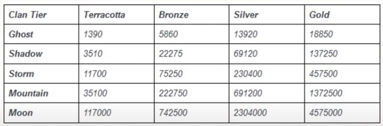

**[Возврат в оглавление](index.md)**

**Назад** 3.о)  [Сердце Деймоса](03_g.md)
***

## 3.п) Операция "Яд Орфикса"

**Операция "Яд Орфикса"** продлится примерно до 18 января 2021. Для доступа нужно пройти квесты: **"Сердце Деймоса" и "Война Внутри"**. 

### Описание

В рамках операции мы получили доступ к трем повторяющимся миссиям(с разными уровнями и числом приходящих **Орфиксов**), в которых нам нужно уничтожать **Орфиксы** - новые юниты Владеющих разумом. 

**Орфикс** создает зону подавления варфреймов. Поэтому операция проходится **Оператором** + **Некрамехом**. Для уничтожения **Орфикса** нужно в 2 этапа: уничтожаем ретрансляторы от 3 до 6 шт, затем стреляем в сердцевину **Орфикса**, до снижения здоровья до 50%, затем появляются новые ретрансляторы и мы их уничтожаем и добиваем **Орфикса**. 

У третьей по счету миссии предел **Орфиксов** на миссии - 36 штук(примерно =20 000 очков). По мере уничтожения **Орфиксов** в текущей миссии очки за их уничтожение увеличиваются. Десятая часть от очков за миссию переводится в Фазовые ячейки. За эти ячейки у Отца Энтрати можно приобрести разные товары, включая: 
* Чертеж Лавоса (Каркас, Система, Нейрооптика, +альт шлем)
* чертеж Седо (ствол, приемник, приклад) 
* Шлем Некрамеха Криптонавт 
* скин Кортежа 
* скин Морги  
* моды Некрамеха 
* глиф "Лавос в действии"
* чертеж Лацеры
* чертеж Басму
* чертеж Формы Стойки
* сигилы Альянса, Клана
* мистификаторы **Темп, Последствие, Момент, Лёд, Обнуление, Тепло, Сопротивление, Заживление, Преломление, Победа, Удар, Пробуждение, Страж, Призрак, Взрыв, Ловкость, Ускорение, Обман, Скорость, Точность, Импульс, Ультиматум, Эгида, Арахнид, Гнев, Ярость, Мститель, Зарядка, Благодать, Барьер**
   - часть из этого списка была в **Операции "Алое Копье"** (январь-май 2020). 

🏦Сколько нужно очков (и времени) с Яда Орфикса на скупку (сборку) всех мистиков у Отца

🥉- Бронза 6 мистиков по 200 *** 200 * 21=4200*6=25200

🥈- Серебро 13 мистиков по 300 *** 300 * 21=6300*13=81900

🥇- Золото 8 мистиков по 400 *** 400 * 21=8400*8=67200

🎖- Платина  3 мистика по 800 *** 800 * 21=16800*3=50400

***
Итого=224700
/2000=112 часов=4,6 дней

* При условии что за час на третьей миссии убиваются все 36 орфиксов и мы получаем 2000 очков миссии

***

Шанс выпадения частей Лавоса с третьей миссии - по 4% на часть (суммарно 16%), альтшлем - 8%. 
Место появления **Орфикса** на миссии меняется каждые 3 **Орфикса**. Повторение мест появления **Орфиксов** по схеме: 1-2-3-3-2-1 (иногда 1-2-3-3-1-2)

Ввели клановые награды. Ниже таблица набора очков для кланов. [Ссылка на онлайн таблицу](http://content.warframe.com/dynamic/orphixVenom.php)
  

### Гайд    
Собственно как проходить: для начала нужно иметь **Некрамеха "Войдриг"** - для нанесения основного урона по открытому ядру **Орфикса** через ульту и команда, которая уничтожает ретрансляторы поля подавления и зачищает мобов.
Можно брать для помощи **"Войдригу"** - **"Вдову"**, но нужно учитывать что у **"Вдовы"** меньше урон (почти никакой) и пользу она может принести вынося ретрансляторы (например если взять Флактус - пробивать через стены)
Раз в полторы минуты на карте (на одном из трех мест спавна) появляется **Орфикс**, с этого момента начинает набираться шкала захвата местности. При достижении 100% миссия считается оконченной. Наша задача - уничтожить **Орфикс** как можно быстрее - уничтожаются ретрансляторы, стреляем в **Ядро**, появляются новые ретрансляторы - уничтожаем их, уничтожаем Ядро - ждем появление следующего **Орфикса**, ну или быстро перемещаемся к следующему, если не успели справиться за полторы минуты и новый **Орфикс** уже появился. Как вариант - при появлении нового **Орфикса** один из Тенно быстро перемещается к нему и уничтожает ретрансляторы и ждет остальную команду (если не хватает своего давага для снижения прочности Ядра).

Данная Операция удобна для прокачивания Некрамехов (до 4.01.2020 - пока действует увеличение синтеза опыта от разрабов)

***
**Далее** 4. [Все боссы ланет](04.md)

**[Возврат в оглавление](index.md)**