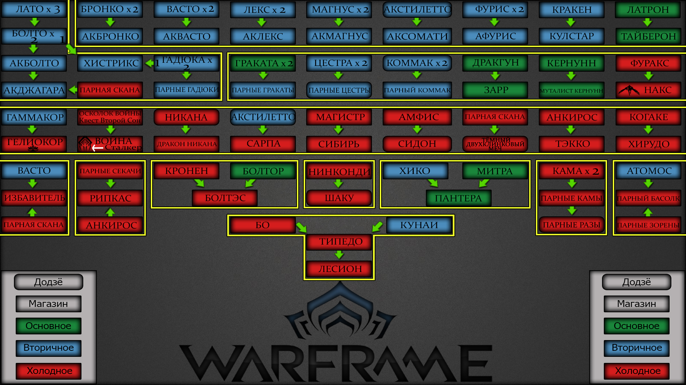

**[Возврат в оглавление](index.md)**

**Назад** 5. [Способности стражей, компаньонов](05.md)

## **6. [Оружие](https://warframe.fandom.com/ru/wiki/%D0%9E%D1%80%D1%83%D0%B6%D0%B8%D0%B5#%D0%9E%D1%81%D0%BD%D0%BE%D0%B2%D0%BD%D0%BE%D0%B5) с особыми эффектами (добавить)**

**Статья про [оружие](https://warframe.fandom.com/ru/wiki/%D0%9E%D1%80%D1%83%D0%B6%D0%B8%D0%B5#%D0%9E%D1%81%D0%BD%D0%BE%D0%B2%D0%BD%D0%BE%D0%B5) на Вики**

### а) оружие синдикатов
* [Синоидальный Гелиокор](https://warframe.fandom.com/ru/wiki/%D0%A1%D0%B8%D0%BD%D0%BE%D0%B8%D0%B4%D0%B0%D0%BB%D1%8C%D0%BD%D1%8B%D0%B9_%D0%93%D0%B5%D0%BB%D0%B8%D0%BE%D0%BA%D0%BE%D1%80) - Враг, убитый данным оружием, будет просканирован, если в инвентаре игрока экипированы [сканер кодекса](https://warframe.fandom.com/ru/wiki/%D0%A1%D0%BA%D0%B0%D0%BD%D0%B5%D1%80_%D0%9A%D0%BE%D0%B4%D0%B5%D0%BA%D1%81%D0%B0) или [сканер синтеза](https://warframe.fandom.com/ru/wiki/%D0%A1%D0%BA%D0%B0%D0%BD%D0%B5%D1%80_%D1%81%D0%B8%D0%BD%D1%82%D0%B5%D0%B7%D0%B0). Если достигнут предел сканирований атакуемого врага, то данный враг, убитый мощной атакой или мощной атакой в прыжке, воскресает и сражается на стороне [Тэнно](https://warframe.fandom.com/ru/wiki/%D0%A2%D1%8D%D0%BD%D0%BD%D0%BE).
- [Синоидальный Гаммакор](https://warframe.fandom.com/ru/wiki/%D0%A1%D0%B8%D0%BD%D0%BE%D0%B8%D0%B4%D0%B0%D0%BB%D1%8C%D0%BD%D1%8B%D0%B9_%D0%93%D0%B0%D0%BC%D0%BC%D0%B0%D0%BA%D0%BE%D1%80) - Имеет встроенный эффект [Энтропия](https://warframe.fandom.com/ru/wiki/%D0%AD%D0%BD%D1%82%D1%80%D0%BE%D0%BF%D0%B8%D1%8F) (наносит 1000 урона по области [магнитом](https://warframe.fandom.com/ru/wiki/%D0%A2%D0%B8%D0%BF%D1%8B_%D0%A3%D1%80%D0%BE%D0%BD%D0%B0_2.0/%D0%9C%D0%B0%D0%B3%D0%BD%D0%B8%D1%82) , восстанавливает 25% от базовой энергии и прибавляет +25% от базового запаса энергии на 30 секунд).
- [Синоидальный Симулор](https://warframe.fandom.com/ru/wiki/%D0%A1%D0%B8%D0%BD%D0%BE%D0%B8%D0%B4%D0%B0%D0%BB%D1%8C%D0%BD%D1%8B%D0%B9_%D0%A1%D0%B8%D0%BC%D1%83%D0%BB%D0%BE%D1%80) - Имеет встроенный эффект [Энтропия](https://warframe.fandom.com/ru/wiki/%D0%AD%D0%BD%D1%82%D1%80%D0%BE%D0%BF%D0%B8%D1%8F) (наносит 1000 урона по области [магнитом](https://warframe.fandom.com/ru/wiki/%D0%A2%D0%B8%D0%BF%D1%8B_%D0%A3%D1%80%D0%BE%D0%BD%D0%B0_2.0/%D0%9C%D0%B0%D0%B3%D0%BD%D0%B8%D1%82) , восстанавливает 25% от базовой энергии и прибавляет +25% от базового запаса энергии на 30 секунд).
- [Телос Болтэс](https://warframe.fandom.com/ru/wiki/%D0%A2%D0%B5%D0%BB%D0%BE%D1%81_%D0%91%D0%BE%D0%BB%D1%82%D1%8D%D1%81) - Обладает уникальной способностью при атаке с разворота производить ударную волну, которая распространяется во всех направлениях, нанося урон ближайшим врагам. Кроме того, пассивно увеличивает эффективность некоторых [манёвров](https://warframe.fandom.com/ru/wiki/%D0%91%D0%BE%D0%B5%D0%B2%D1%8B%D0%B5_%D0%BC%D0%B0%D0%BD%D1%91%D0%B2%D1%80%D1%8B) на 20%. Обе способности работают только при ношении в руках. Ударная волна атаки с разворота имеет 100% шанс наложения статуса.
- [Телос Болтор](https://warframe.fandom.com/ru/wiki/%D0%A2%D0%B5%D0%BB%D0%BE%D1%81_%D0%91%D0%BE%D0%BB%D1%82%D0%BE%D1%80) - Имеет встроенный эффект [Правда](https://warframe.fandom.com/ru/wiki/%D0%9F%D1%80%D0%B0%D0%B2%D0%B4%D0%B0) (наносит 1000 урона по области [газом](https://warframe.fandom.com/ru/wiki/%D0%A2%D0%B8%D0%BF%D1%8B_%D0%A3%D1%80%D0%BE%D0%BD%D0%B0_2.0/%D0%93%D0%B0%D0%B7) , восстанавливает 25% здоровья и на +25% усиливает паркур на 30 секунд).
- [Телос Акболто](https://warframe.fandom.com/ru/wiki/%D0%A2%D0%B5%D0%BB%D0%BE%D1%81_%D0%90%D0%BA%D0%B1%D0%BE%D0%BB%D1%82%D0%BE)  - Имеет встроенный эффект [Правда](https://warframe.fandom.com/ru/wiki/%D0%9F%D1%80%D0%B0%D0%B2%D0%B4%D0%B0) (наносит 1000 урона по области [газом](https://warframe.fandom.com/ru/wiki/%D0%A2%D0%B8%D0%BF%D1%8B_%D0%A3%D1%80%D0%BE%D0%BD%D0%B0_2.0/%D0%93%D0%B0%D0%B7) , восстанавливает 25% здоровья и на +25% усиливает паркур на 30 секунд).
- [Ракта Тёмный Кинжал](https://warframe.fandom.com/ru/wiki/%D0%A0%D0%B0%D0%BA%D1%82%D0%B0_%D0%A2%D1%91%D0%BC%D0%BD%D1%8B%D0%B9_%D0%9A%D0%B8%D0%BD%D0%B6%D0%B0%D0%BB) - Обладает уникальной способностью уменьшать видимость Варфрейма, также при нанесении урона клинком восстанавливает [щиты](https://warframe.fandom.com/ru/wiki/%D0%A9%D0%B8%D1%82) и добавляет [экстращиты](https://warframe.fandom.com/ru/wiki/%D0%A9%D0%B8%D1%82#.D0.AD.D0.BA.D1.81.D1.82.D1.80.D0.B0.D1.89.D0.B8.D1.82.D1.8B), если цель находится под действием [статуса](https://warframe.fandom.com/ru/wiki/%D0%A1%D1%82%D0%B0%D1%82%D1%83%D1%81) [радиации](https://warframe.fandom.com/ru/wiki/%D0%A2%D0%B8%D0%BF%D1%8B_%D0%A3%D1%80%D0%BE%D0%BD%D0%B0_2.0/%D0%A0%D0%B0%D0%B4%D0%B8%D0%B0%D1%86%D0%B8%D1%8F).
  *   Уменьшает радиус видимости врагами до 10 метров при ношении в руках или следующие 30 секунд с момента взятия в руки.
  *   При успешном ударе кинжалом по врагу находящемуся под эффектом радиации восстанавливает часть [щитов](https://warframe.fandom.com/ru/wiki/%D0%A9%D0%B8%D1%82) в размере 5% от нанесённого урона. Если [щит](https://warframe.fandom.com/ru/wiki/%D0%A9%D0%B8%D1%82) Варфрейма полон, то будет добавляться [экстращит](https://warframe.fandom.com/ru/wiki/%D0%A9%D0%B8%D1%82#.D0.AD.D0.BA.D1.81.D1.82.D1.80.D0.B0.D1.89.D0.B8.D1.82.D1.8B).
  *   Возможность установки мода [Блестящая Гниль](https://warframe.fandom.com/ru/wiki/%D0%91%D0%BB%D0%B5%D1%81%D1%82%D1%8F%D1%89%D0%B0%D1%8F_%D0%93%D0%BD%D0%B8%D0%BB%D1%8C).
  *   Добивающий удар при взятом кинжале добавляет максимальный [экстращит](https://warframe.fandom.com/ru/wiki/%D0%A9%D0%B8%D1%82#.D0.AD.D0.BA.D1.81.D1.82.D1.80.D0.B0.D1.89.D0.B8.D1.82.D1.8B) если на цели была наложена радиация.
- [Ракта Баллистика](https://warframe.fandom.com/ru/wiki/%D0%A0%D0%B0%D0%BA%D1%82%D0%B0_%D0%91%D0%B0%D0%BB%D0%BB%D0%B8%D1%81%D1%82%D0%B8%D0%BA%D0%B0) - Усиленный выстрел отбрасывает (тела) мертвых врагов, таким образом можно нанести урон нескольким противникам, если они стоят на одной линии. Имеет встроенный эффект [Гниль](https://warframe.fandom.com/ru/wiki/%D0%A1%D0%B8%D0%BD%D0%B4%D0%B8%D0%BA%D0%B0%D1%82%D1%8B#.D0.9D.D0.B0.D0.B3.D1.80.D0.B0.D0.B4.D1.8B_4_.D1.80.D0.B0.D0.BD.D0.B3.D0.B0) (наносит 1000 урона по области [вирусом](https://warframe.fandom.com/ru/wiki/%D0%A2%D0%B8%D0%BF%D1%8B_%D0%A3%D1%80%D0%BE%D0%BD%D0%B0_2.0/%D0%92%D0%B8%D1%80%D1%83%D1%81) , восстанавливает 25% энергии и прибавляет +10% к скорости передвижения на 30 секунд).
- [Ракта Кернунн](https://warframe.fandom.com/ru/wiki/%D0%A0%D0%B0%D0%BA%D1%82%D0%B0_%D0%9A%D0%B5%D1%80%D0%BD%D1%83%D0%BD%D0%BD) - Имеет встроенный эффект [Гниль](https://warframe.fandom.com/ru/wiki/%D0%A1%D0%B8%D0%BD%D0%B4%D0%B8%D0%BA%D0%B0%D1%82%D1%8B#.D0.9D.D0.B0.D0.B3.D1.80.D0.B0.D0.B4.D1.8B_4_.D1.80.D0.B0.D0.BD.D0.B3.D0.B0) (наносит 1000 урона по области [вирусом](https://warframe.fandom.com/ru/wiki/%D0%A2%D0%B8%D0%BF%D1%8B_%D0%A3%D1%80%D0%BE%D0%BD%D0%B0_2.0/%D0%92%D0%B8%D1%80%D1%83%D1%81) , восстанавливает 25% от базового значения энергии и прибавляет +10% к скорости передвижения на 30 секунд). Врождённое [пронзание навылет](https://warframe.fandom.com/ru/wiki/%D0%9F%D1%80%D0%BE%D0%BD%D0%B7%D0%B0%D0%BD%D0%B8%D0%B5_%D0%9D%D0%B0%D0%B2%D1%8B%D0%BB%D0%B5%D1%82) при максимальном натяжении тетивы.
* [Секура Лекта](https://warframe.fandom.com/ru/wiki/%D0%A1%D0%B5%D0%BA%D1%83%D1%80%D0%B0_%D0%9B%D0%B5%D0%BA%D1%82%D0%B0) - [Электрический](https://warframe.fandom.com/ru/wiki/%D0%A2%D0%B8%D0%BF%D1%8B_%D0%A3%D1%80%D0%BE%D0%BD%D0%B0_2.0/%D0%AD%D0%BB%D0%B5%D0%BA%D1%82%D1%80%D0%BE) урон можно комбинировать в [Магнит](https://warframe.fandom.com/ru/wiki/%D0%A2%D0%B8%D0%BF%D1%8B_%D0%A3%D1%80%D0%BE%D0%BD%D0%B0_2.0/%D0%9C%D0%B0%D0%B3%D0%BD%D0%B8%D1%82), [Коррозию](https://warframe.fandom.com/ru/wiki/%D0%A2%D0%B8%D0%BF%D1%8B_%D0%A3%D1%80%D0%BE%D0%BD%D0%B0_2.0/%D0%9A%D0%BE%D1%80%D1%80%D0%BE%D0%B7%D0%B8%D1%8F) или [Радиацию](https://warframe.fandom.com/ru/wiki/%D0%A2%D0%B8%D0%BF%D1%8B_%D0%A3%D1%80%D0%BE%D0%BD%D0%B0_2.0/%D0%A0%D0%B0%D0%B4%D0%B8%D0%B0%D1%86%D0%B8%D1%8F), позволяя настраивать оружие против любой фракции. Атака в прыжке сбивает врагов с ног.
* [Секура Пента](https://warframe.fandom.com/ru/wiki/%D0%A1%D0%B5%D0%BA%D1%83%D1%80%D0%B0_%D0%9F%D0%B5%D0%BD%D1%82%D0%B0) - Имеет встроенный эффект [Последовательность](https://warframe.fandom.com/ru/wiki/%D0%9F%D0%BE%D1%81%D0%BB%D0%B5%D0%B4%D0%BE%D0%B2%D0%B0%D1%82%D0%B5%D0%BB%D1%8C%D0%BD%D0%BE%D1%81%D1%82%D1%8C)(наносит 1000 урона по области [радиацией](https://warframe.fandom.com/ru/wiki/%D0%A2%D0%B8%D0%BF%D1%8B_%D0%A3%D1%80%D0%BE%D0%BD%D0%B0_2.0/%D0%A0%D0%B0%D0%B4%D0%B8%D0%B0%D1%86%D0%B8%D1%8F) , восстанавливает 25% щитов и прибавляет +50% к максимальному запасу щитов на 30 секунд).
- [Парные Цестры Секура](https://warframe.fandom.com/ru/wiki/%D0%9F%D0%B0%D1%80%D0%BD%D1%8B%D0%B5_%D0%A6%D0%B5%D1%81%D1%82%D1%80%D1%8B_%D0%A1%D0%B5%D0%BA%D1%83%D1%80%D0%B0) - Имеет встроенный эффект [Последовательность](https://warframe.fandom.com/ru/wiki/%D0%9F%D0%BE%D1%81%D0%BB%D0%B5%D0%B4%D0%BE%D0%B2%D0%B0%D1%82%D0%B5%D0%BB%D1%8C%D0%BD%D0%BE%D1%81%D1%82%D1%8C) (наносит 1000 урона по области [радиацией](https://warframe.fandom.com/ru/wiki/%D0%A2%D0%B8%D0%BF%D1%8B_%D0%A3%D1%80%D0%BE%D0%BD%D0%B0_2.0/%D0%A0%D0%B0%D0%B4%D0%B8%D0%B0%D1%86%D0%B8%D1%8F), восстанавливает 25% щитов и прибавляет +50% к максимальному запасу щитов на 30 секунд).
- [Вэйкор Сидон](https://warframe.fandom.com/ru/wiki/%D0%92%D1%8D%D0%B9%D0%BA%D0%BE%D1%80_%D0%A1%D0%B8%D0%B4%D0%BE%D0%BD) - Ношение в руках обеспечивает Варфрейму 50% сопротивление сбиванию с ног. Блокируя вражеский урон, можно ослепить ближайших врагов (см. примечания).
- [Вэйкор Хэк](https://warframe.fandom.com/ru/wiki/%D0%92%D1%8D%D0%B9%D0%BA%D0%BE%D1%80_%D0%A5%D0%B5%D0%BA)  - Имеет встроенный эффект [Справедливость](https://warframe.fandom.com/ru/wiki/%D0%A1%D0%BF%D1%80%D0%B0%D0%B2%D0%B5%D0%B4%D0%BB%D0%B8%D0%B2%D0%BE%D1%81%D1%82%D1%8C) (наносит 1000 урона по области [взрывом](https://warframe.fandom.com/ru/wiki/%D0%A2%D0%B8%D0%BF%D1%8B_%D0%A3%D1%80%D0%BE%D0%BD%D0%B0_2.0/%D0%92%D0%B7%D1%80%D1%8B%D0%B2) , восстанавливает 25% здоровья и прибавляет +25% к броне на 30 секунд).
- [Вэйкор Мэрлок](https://warframe.fandom.com/ru/wiki/%D0%92%D1%8D%D0%B9%D0%BA%D0%BE%D1%80_%D0%9C%D1%8D%D1%80%D0%BB%D0%BE%D0%BA) -  Имеет встроенный эффект [Справедливость](https://warframe.fandom.com/ru/wiki/%D0%A1%D0%BF%D1%80%D0%B0%D0%B2%D0%B5%D0%B4%D0%BB%D0%B8%D0%B2%D0%BE%D1%81%D1%82%D1%8C) (наносит 1000 урона по области [взрывом](https://warframe.fandom.com/ru/wiki/%D0%A2%D0%B8%D0%BF%D1%8B_%D0%A3%D1%80%D0%BE%D0%BD%D0%B0_2.0/%D0%92%D0%B7%D1%80%D1%8B%D0%B2) , восстанавливает 25% здоровья и прибавляет +25% к броне на 30 секунд).
- [Санкти Магистр](https://warframe.fandom.com/ru/wiki/%D0%A1%D0%B0%D0%BD%D0%BA%D1%82%D0%B8_%D0%9C%D0%B0%D0%B3%D0%B8%D1%81%D1%82%D1%80) - Врожденный 10% шанс [взрывного](https://warframe.fandom.com/ru/wiki/%D0%A2%D0%B8%D0%BF%D1%8B_%D0%A3%D1%80%D0%BE%D0%BD%D0%B0_2.0/%D0%92%D0%B7%D1%80%D1%8B%D0%B2) статус эффекта. Атаки нельзя прервать. Заряженная атака выбивает из врага импульс жизненной энергии (подобно импульсу [древнего целителя](https://warframe.fandom.com/ru/wiki/%D0%94%D1%80%D0%B5%D0%B2%D0%BD%D0%B8%D0%B9_%D1%86%D0%B5%D0%BB%D0%B8%D1%82%D0%B5%D0%BB%D1%8C)).
- [Санкти Тигрис](https://warframe.fandom.com/ru/wiki/%D0%A1%D0%B0%D0%BD%D0%BA%D1%82%D0%B8_%D0%A2%D0%B8%D0%B3%D1%80%D0%B8%D1%81) - Имеет встроенный эффект [Чистота](https://warframe.fandom.com/ru/wiki/%D0%A7%D0%B8%D1%81%D1%82%D0%BE%D1%82%D0%B0) (наносит 1000 урона по области [коррозией](https://warframe.fandom.com/ru/wiki/%D0%A2%D0%B8%D0%BF%D1%8B_%D0%A3%D1%80%D0%BE%D0%BD%D0%B0_2.0/%D0%9A%D0%BE%D1%80%D1%80%D0%BE%D0%B7%D0%B8%D1%8F) , восстанавливает 25% здоровья и прибавляет +25% к максимальному запасу здоровья на 30 секунд).
- [Санкти Кастанас](https://warframe.fandom.com/ru/wiki/%D0%A1%D0%B0%D0%BD%D0%BA%D1%82%D0%B8_%D0%9A%D0%B0%D1%81%D1%82%D0%B0%D0%BD%D0%B0%D1%81) - Имеет встроенный эффект [Чистота](https://warframe.fandom.com/ru/wiki/%D0%A7%D0%B8%D1%81%D1%82%D0%BE%D1%82%D0%B0) (наносит 1000 урона по области [коррозией](https://warframe.fandom.com/ru/wiki/%D0%A2%D0%B8%D0%BF%D1%8B_%D0%A3%D1%80%D0%BE%D0%BD%D0%B0_2.0/%D0%9A%D0%BE%D1%80%D1%80%D0%BE%D0%B7%D0%B8%D1%8F) , восстанавливает 25% здоровья и прибавляет +25% к максимальному запасу здоровья на 30 секунд).

\\\\\\\\\\\\\\\\\\\\\\\\\\\\\\\\\\\\\\\\\\\\\\\\\\\\\\\\\\\\\\\\\\\\\\\\\\\\\\\\\\\\\\\\\\\\\\\\\\\\\\\\\\\\\\\\\\\\\\\\

### б) основное оружие

Особые свойства (полная информация на Wiki)

- **[Аргонак](https://warframe.fandom.com/ru/wiki/%D0%90%D1%80%D0%B3%D0%BE%D0%BD%D0%B0%D0%BA)** - Подсвечивает врагов в режиме прицеливания
- **[База](https://ru.wikipedia.org/wiki/%D0%91%D0%B0%D0%B7%D0%B0)** - Бесшумная стрельба
- **[Баттакор](https://warframe.fandom.com/ru/wiki/%D0%91%D0%B0%D1%82%D1%82%D0%B0%D0%BA%D0%BE%D1%80)** - Убийства этим оружием накапливают до 3 зарядов, которые расходуются при использовании альтернативной атаки (по умолчанию СКМ) для проведения мощного одиночного залпа (на подобии выстрела [Оптикора](https://warframe.fandom.com/ru/wiki/%D0%9E%D0%BF%D1%82%D0%B8%D0%BA%D0%BE%D1%80)).
- **[Берстон](https://warframe.fandom.com/ru/wiki/%D0%91%D1%91%D1%80%D1%81%D1%82%D0%BE%D0%BD_%D0%9F%D1%80%D0%B0%D0%B9%D0%BC)** - стрельба по 3 патрона
- **[Бузлок](https://warframe.fandom.com/ru/wiki/%D0%91%D1%83%D0%B7%D0%BB%D0%BE%D0%BA)** - При попадании в цель/объект альтернативным огнём, все следующие снаряды будут автоматически наводиться в заданную точку в течении 20-ти секунд
- **[Болтор Прайм](https://warframe.fandom.com/ru/wiki/%D0%91%D0%BE%D0%BB%D1%82%D0%BE%D1%80_%D0%9F%D1%80%D0%B0%D0%B9%D0%BC)** - Отбрасывает цель назад при убийстве и наносит урон другой цели на пути.
- **[Гема](https://warframe.fandom.com/ru/wiki/%D0%93%D0%B5%D0%BC%D0%B0)** - Попадания в голову восстанавливают игроку 10%здоровья. Бесконечный боезапас(патроны автоматически восполняются за счёт здоровья при перезарядке).
- **[Горгона](https://warframe.fandom.com/ru/wiki/%D0%93%D0%BE%D1%80%D0%B3%D0%BE%D0%BD%D0%B0)** ([Призма](https://warframe.fandom.com/ru/wiki/%D0%93%D0%BE%D1%80%D0%B3%D0%BE%D0%BD%D0%B0_%D0%9F%D1%80%D0%B8%D0%B7%D0%BC%D0%B0)/[Призрак](https://warframe.fandom.com/ru/wiki/%D0%93%D0%BE%D1%80%D0%B3%D0%BE%D0%BD%D0%B0_%D0%9F%D1%80%D0%B8%D0%B7%D1%80%D0%B0%D0%BA)) - До разгона позволяет посылать одиночные выстрелы. Короткие паузы для прицеливания не снижают скорострельность.
- **[Дера](https://warframe.fandom.com/ru/wiki/%D0%94%D0%B5%D1%80%D0%B0)** - Бегуны заражённых не взрываются при убийстве
- **[Зенит](https://warframe.fandom.com/ru/wiki/%D0%97%D0%B5%D0%BD%D0%B8%D1%82)** - автоматическая винтовка, при активации диска которой, тип стрельбы изменяется на полу-автоматический, использующий 5 патронов за 1 выстрел. Полу-автоматический режим - Установленный диск отображает врагов в радиусе 22-х метров сквозь любые препятствия в течение 30 секунд.
- **[Куартак](https://warframe.fandom.com/ru/wiki/%D0%9A%D0%B0%D1%82%D0%B5%D0%B3%D0%BE%D1%80%D0%B8%D1%8F:%D0%92%D0%B8%D0%BD%D1%82%D0%BE%D0%B2%D0%BA%D0%B8)**- Тратит 4 патрона за выстрел. Врожденное пронзание навылет - 0.5 метра. 
- **[Лань](https://warframe.fandom.com/ru/wiki/%D0%9B%D0%B0%D0%BD%D1%8C)** - стреляет очередями по 5 выстрелов.
- **[Латрон Призрак](https://warframe.fandom.com/ru/wiki/%D0%9B%D0%B0%D1%82%D1%80%D0%BE%D0%BD_%D0%9F%D1%80%D0%B8%D0%B7%D1%80%D0%B0%D0%BA)** - Является "тихим" оружием (враги слышат выстрел с меньшего расстояния).
- **[Муталист Кванта](https://warframe.fandom.com/ru/wiki/%D0%9C%D1%83%D1%82%D0%B0%D0%BB%D0%B8%D1%81%D1%82_%D0%9A%D0%B2%D0%B0%D0%BD%D1%82%D0%B0)** - Вторичная атака может нанести урон игроку. Вторичный огонь:
*   Сфера летит вперед в течении 9 секунд, а затем взрывается, нанося урон [токсином](https://warframe.fandom.com/ru/wiki/%D0%A2%D0%B8%D0%BF%D1%8B_%D0%A3%D1%80%D0%BE%D0%BD%D0%B0_2.0/%D0%A2%D0%BE%D0%BA%D1%81%D0%B8%D0%BD) в радиусе 8 метров.
*   При столкновении с противником, сфера наносит урон [радиацией](https://warframe.fandom.com/ru/wiki/%D0%A2%D0%B8%D0%BF%D1%8B_%D0%A3%D1%80%D0%BE%D0%BD%D0%B0_2.0/%D0%A0%D0%B0%D0%B4%D0%B8%D0%B0%D1%86%D0%B8%D1%8F) в радиусе 1 метр со 100% шансом срабатывания [статуса](https://warframe.fandom.com/ru/wiki/%D0%A1%D1%82%D0%B0%D1%82%D1%83%D1%81).
*   Даёт сильную прибавку к базовому значению шанса критического урона (~25-30%) выстрелам сквозь сферу.- Подробнее на Вики
- **[Парацист](https://warframe.fandom.com/ru/wiki/%D0%9F%D0%B0%D1%80%D0%B0%D1%86%D0%B8%D1%81%D1%82)** -  Альтернативная атака: выстрел жалом:
  *   При удержании клавиши альтернативной атаки производится зарядка особого гарпуна-жала, которое при попадании во врага, наносит периодический урон.
  *   Сразу после попадания цель притягивается к игроку, если она не находится на слишком большом расстоянии.
  *   Во время притягивания цель подвластна физике.
  *   Жало некоторое время наносит периодический урон, каждый тик которого может наложить на противника статус и имеет тот же тип элементального урона, что и основная атака.
  *   Врагов, притянутых альтернативной атакой, нельзя притянуть вновь сразу же, должно пройти некоторое время, о чём свидетельствует жёлтая аура вокруг них.
- **[Сома](https://warframe.fandom.com/ru/wiki/%D0%A1%D0%BE%D0%BC%D0%B0)** - высокий шанс крит.урона
- **[Супра](https://warframe.fandom.com/ru/wiki/%D0%A1%D1%83%D0%BF%D1%80%D0%B0)** - пулемет - большая обойма (180), большая скорострельность
- **[Тенора](https://warframe.fandom.com/ru/wiki/%D0%A2%D0%B5%D0%BD%D0%BE%D1%80%D0%B0)** - пулемет - большая обойма (150), большая точность после разгона (100), высокие криты, 2 режима стрельбы (автомат/заряженный выстрел)
- **[Тонкор](https://warframe.fandom.com/ru/wiki/%D0%A2%D0%BE%D0%BD%D0%BA%D0%BE%D1%80)** - при взрыве наносит урон самому игроку
- **[Фульмин](https://warframe.fandom.com/ru/wiki/%D0%A4%D1%83%D0%BB%D1%8C%D0%BC%D0%B8%D0%BD)** - 2 режима стрельбы (полуавтомат/автомат). Врожденный [электрический](https://warframe.fandom.com/ru/wiki/%D0%A2%D0%B8%D0%BF%D1%8B_%D1%83%D1%80%D0%BE%D0%BD%D0%B0_2.0/%D0%AD%D0%BB%D0%B5%D0%BA%D1%82%D1%80%D0%BE) урон
  *   Бесконечный боезапас, который восстанавливается со временем (восстановление начинается спустя 1 секунду после прекращения стрельбы и восполняет 30 ед. боеприпасов в секунду; при полном опустошении магазина время полного восстановления боезапаса составляет 3 секунды)
- **[Харпак](https://warframe.fandom.com/ru/wiki/%D0%A5%D0%B0%D1%80%D0%BF%D0%B0%D0%BA)** - альтернативный режим стрельбы -  гарпун - позволяет повалить противников на землю, что позволяет произвести добивание. Альтернативный режим стрельбы накладывает на противника [пронзание](https://warframe.fandom.com/ru/wiki/%D0%A2%D0%B8%D0%BF%D1%8B_%D0%A3%D1%80%D0%BE%D0%BD%D0%B0_2.0/%D0%9F%D1%80%D0%BE%D0%BD%D0%B7%D0%B0%D0%BD%D0%B8%D0%B5) со 100%-ым шансом.
- **[Ампрекс](https://warframe.fandom.com/ru/wiki/%D0%90%D0%BC%D0%BF%D1%80%D0%B5%D0%BA%D1%81)** - Врожденный [электрический](https://warframe.fandom.com/ru/wiki/%D0%A2%D0%B8%D0%BF%D1%8B_%D1%83%D1%80%D0%BE%D0%BD%D0%B0_2.0/%D0%AD%D0%BB%D0%B5%D0%BA%D1%82%D1%80%D0%BE) урон. При выстреле по группе врагов создаёт электрическую дугу радиусом ~10 метров, поражающую соседних врагов. - Подробнее на Вики
- **[Глаксион](https://warframe.fandom.com/ru/wiki/%D0%93%D0%BB%D0%B0%D0%BA%D1%81%D0%B8%D0%BE%D0%BD)** - Замедляет противников даже если имеет комбинированный тип урона вместо базового [ледяного](https://warframe.fandom.com/ru/wiki/%D0%A2%D0%B8%D0%BF%D1%8B_%D1%83%D1%80%D0%BE%D0%BD%D0%B0_2.0/%D0%9B%D1%91%D0%B4).
- **[Игнис](https://warframe.fandom.com/ru/wiki/%D0%98%D0%B3%D0%BD%D0%B8%D1%81)** - Врожденный [огненный](https://warframe.fandom.com/ru/wiki/%D0%A2%D0%B8%D0%BF%D1%8B_%D1%83%D1%80%D0%BE%D0%BD%D0%B0_2.0/%D0%9E%D0%B3%D0%BE%D0%BD%D1%8C) урон.
- **[Кванта](https://warframe.fandom.com/ru/wiki/%D0%9A%D0%B2%D0%B0%D0%BD%D1%82%D0%B0)** - Высокий урон в секунду. Врожденный [электрический](https://warframe.fandom.com/ru/wiki/%D0%A2%D0%B8%D0%BF%D1%8B_%D1%83%D1%80%D0%BE%D0%BD%D0%B0_2.0/%D0%AD%D0%BB%D0%B5%D0%BA%D1%82%D1%80%D0%BE) урон. Альтернативный режим огня создает куб, который взрывается при столкновении с целью, либо, не столкнувшись с ней, спустя несколько секунд, нанося [взрывной](https://warframe.fandom.com/ru/wiki/%D0%A2%D0%B8%D0%BF%D1%8B_%D1%83%D1%80%D0%BE%D0%BD%D0%B0_2.0/%D0%92%D0%B7%D1%80%D1%8B%D0%B2) урон. Куб можно взорвать вручную, выстрелив в него основным огнем или ударив оружием ближнего боя
- **[Потоковая винтовка](https://warframe.fandom.com/ru/wiki/%D0%9F%D0%BE%D1%82%D0%BE%D0%BA%D0%BE%D0%B2%D0%B0%D1%8F_%D0%92%D0%B8%D0%BD%D1%82%D0%BE%D0%B2%D0%BA%D0%B0)** - Врождённое [пронзание](https://warframe.fandom.com/ru/wiki/%D0%9F%D1%80%D0%BE%D0%BD%D0%B7%D0%B0%D0%BD%D0%B8%D0%B5_%D0%9D%D0%B0%D0%B2%D1%8B%D0%BB%D0%B5%D1%82) стен и врагов. Не требует пополнения боезапаса, т.к. восстанавливает патроны в обойме с течением времени. - Подробнее на Вики
- **[Синапс](https://warframe.fandom.com/ru/wiki/%D0%A1%D0%B8%D0%BD%D0%B0%D0%BF%D1%81)** - Врожденный урон 
[ Коррозией](https://warframe.fandom.com/ru/wiki/%D0%A2%D0%B8%D0%BF%D1%8B_%D1%83%D1%80%D0%BE%D0%BD%D0%B0_2.0/%D0%9A%D0%BE%D1%80%D1%80%D0%BE%D0%B7%D0%B8%D1%8F). Может пробить щит [Щитоносцев](https://warframe.fandom.com/ru/wiki/%D0%A9%D0%B8%D1%82%D0%BE%D0%BD%D0%BE%D1%81%D0%B5%D1%86).

- **[Арка Плазмор](https://warframe.fandom.com/ru/wiki/%D0%90%D1%80%D0%BA%D0%B0_%D0%9F%D0%BB%D0%B0%D0%B7%D0%BC%D0%BE%D1%80)** - Высокий урон  [радиацией](https://warframe.fandom.com/ru/wiki/%D0%A2%D0%B8%D0%BF%D1%8B_%D1%83%D1%80%D0%BE%D0%BD%D0%B0_2.0/%D0%A0%D0%B0%D0%B4%D0%B8%D0%B0%D1%86%D0%B8%D1%8F). Выстрел гарантированно наносит эффект [удара](https://warframe.fandom.com/ru/wiki/%D0%A2%D0%B8%D0%BF%D1%8B_%D1%83%D1%80%D0%BE%D0%BD%D0%B0_2.0/%D0%A3%D0%B4%D0%B0%D1%80), если цель находится в пределах 15 метров.

- **[Астилла](https://warframe.fandom.com/ru/wiki/%D0%90%D1%81%D1%82%D0%B8%D0%BB%D0%BB%D0%B0)** - Высокий урон [разрезом](https://warframe.fandom.com/ru/wiki/%D0%A2%D0%B8%D0%BF%D1%8B_%D1%83%D1%80%D0%BE%D0%BD%D0%B0_2.0/%D0%A0%D0%B0%D0%B7%D1%80%D0%B5%D0%B7) и [ударом](https://warframe.fandom.com/ru/wiki/%D0%A2%D0%B8%D0%BF%D1%8B_%D1%83%D1%80%D0%BE%D0%BD%D0%B0_2.0/%D0%A3%D0%B4%D0%B0%D1%80) - эффективно против [щитов](https://warframe.fandom.com/ru/wiki/%D0%A9%D0%B8%D1%82%D1%8B) и [здоровья](https://warframe.fandom.com/ru/wiki/%D0%97%D0%B4%D0%BE%D1%80%D0%BE%D0%B2%D1%8C%D0%B5). Снаряды при попадании накладывают статус [Удара](https://warframe.fandom.com/ru/wiki/%D0%A2%D0%B8%D0%BF%D1%8B_%D1%83%D1%80%D0%BE%D0%BD%D0%B0_2.0/%D0%A3%D0%B4%D0%B0%D1%80).  При попадании в противника или твердую поверхность снаряд взрывается нанося дополнительный урон в радиусе ~2 метров

- **[Дракгун](https://warframe.fandom.com/ru/wiki/%D0%94%D1%80%D0%B0%D0%BA%D0%B3%D1%83%D0%BD)** - [Пронзание Навылет](https://warframe.fandom.com/ru/wiki/%D0%9F%D1%80%D0%BE%D0%BD%D0%B7%D0%B0%D0%BD%D0%B8%D0%B5_%D0%9D%D0%B0%D0%B2%D1%8B%D0%BB%D0%B5%D1%82) 1.5 метра при зарядке. Заряженные выстрелы могут убить [Щитоносца](https://warframe.fandom.com/ru/wiki/%D0%A9%D0%B8%D1%82%D0%BE%D0%BD%D0%BE%D1%81%D0%B5%D1%86) через щит. Выстрелы рикошетят. Урон от заряженного выстрела не падает с расстоянием.

- **[Комм](https://warframe.fandom.com/ru/wiki/Комм)** - Врождённое [пронзание навылет](https://warframe.fandom.com/ru/wiki/%D0%9F%D1%80%D0%BE%D0%BD%D0%B7%D0%B0%D0%BD%D0%B8%D0%B5_%D0%9D%D0%B0%D0%B2%D1%8B%D0%BB%D0%B5%D1%82) 1 метр. Вместительный магазин (245). Большое количество дроби при максимальном разгоне (12 штук). Средняя потеря урона с расстоянием - 46%.

- **[Коринф](https://warframe.fandom.com/ru/wiki/%D0%9A%D0%BE%D1%80%D0%B8%D0%BD%D1%84)** - Высокий множитель [критического урона](https://warframe.fandom.com/ru/wiki/%D0%9A%D1%80%D0%B8%D1%82%D0%B8%D1%87%D0%B5%D1%81%D0%BA%D0%B8%D0%B9_%D1%83%D1%80%D0%BE%D0%BD) (2.8). Перезаряжается по 1 патрону каждые 0,46 сек.

- **[Фаг](https://warframe.fandom.com/ru/wiki/%D0%A4%D0%B0%D0%B3)** - Врождённый [вирусный](https://warframe.fandom.com/ru/wiki/%D0%A2%D0%B8%D0%BF%D1%8B_%D1%83%D1%80%D0%BE%D0%BD%D0%B0_2.0/%D0%92%D0%B8%D1%80%D1%83%D1%81) урон. Дальность до 25 м.

- **[Фантазма](https://warframe.fandom.com/ru/wiki/%D0%A4%D0%B0%D0%BD%D1%82%D0%B0%D0%B7%D0%BC%D0%B0)** - Наносит урон [радиацией](https://warframe.fandom.com/ru/wiki/%D0%A2%D0%B8%D0%BF%D1%8B_%D1%83%D1%80%D0%BE%D0%BD%D0%B0_2.0/%D0%A0%D0%B0%D0%B4%D0%B8%D0%B0%D1%86%D0%B8%D1%8F). Альтернативная атака - создает дополнительные самонаводящиеся снаряды с небольшим радиусом поражения.

- **[Эксергис](https://warframe.fandom.com/ru/wiki/%D0%AD%D0%BA%D1%81%D0%B5%D1%80%D0%B3%D0%B8%D1%81)** - Врожденный урон [радиацией](https://warframe.fandom.com/ru/wiki/%D0%A2%D0%B8%D0%BF%D1%8B_%D1%83%D1%80%D0%BE%D0%BD%D0%B0_2.0/%D0%A0%D0%B0%D0%B4%D0%B8%D0%B0%D1%86%D0%B8%D1%8F). Врожденное [пронзание навылет](https://warframe.fandom.com/ru/wiki/%D0%9F%D1%80%D0%BE%D0%BD%D0%B7%D0%B0%D0%BD%D0%B8%D0%B5_%D0%9D%D0%B0%D0%B2%D1%8B%D0%BB%D0%B5%D1%82) — 0.5 метра. На 1 патрон.

- **[Вектис](https://warframe.fandom.com/ru/wiki/%D0%92%D0%B5%D0%BA%D1%82%D0%B8%D1%81)** - снайперка - магазин на 1 патрон

- **[Вулкар](https://warframe.fandom.com/ru/wiki/%D0%92%D1%83%D0%BB%D0%BA%D0%B0%D1%80)** - снайперка - высокие повреждения [ударным](https://warframe.fandom.com/ru/wiki/%D0%A2%D0%B8%D0%BF%D1%8B_%D1%83%D1%80%D0%BE%D0%BD%D0%B0_2.0/%D0%A3%D0%B4%D0%B0%D1%80) уроном

- **[Коморекс](https://warframe.fandom.com/ru/wiki/%D0%9A%D0%BE%D0%BC%D0%BE%D1%80%D0%B5%D0%BA%D1%81)** - Включение режима приближения (по умолчанию, нажатие средней кнопки мыши при зажатой ПКМ) сопровождаются положительными эффектами: Приближение 2.0x: отдача -50%, [пронзание навылет](https://warframe.fandom.com/ru/wiki/%D0%9F%D1%80%D0%BE%D0%BD%D0%B7%D0%B0%D0%BD%D0%B8%D0%B5_%D0%9D%D0%B0%D0%B2%D1%8B%D0%BB%D0%B5%D1%82) +2 метра.  Приближение 3.5x: +100% урона, попадания вызывают взрывы радиусом ~3.5 метра, наносящие [вирусный](https://warframe.fandom.com/ru/wiki/%D0%A2%D0%B8%D0%BF%D1%8B_%D1%83%D1%80%D0%BE%D0%BD%D0%B0_2.0/%D0%92%D0%B8%D1%80%D1%83%D1%81) урон; при этом снижается скорострельность на 75%.

- **[Ланка](https://warframe.fandom.com/ru/wiki/%D0%9B%D0%B0%D0%BD%D0%BA%D0%B0)** - снайперка - Высокий базовый [электрический](https://warframe.fandom.com/ru/wiki/%D0%A2%D0%B8%D0%BF%D1%8B_%D1%83%D1%80%D0%BE%D0%BD%D0%B0_2.0/%D0%AD%D0%BB%D0%B5%D0%BA%D1%82%D1%80%D0%BE) урон.  Врождённое [пронзание навылет](https://warframe.fandom.com/ru/wiki/%D0%9F%D1%80%D0%BE%D0%BD%D0%B7%D0%B0%D0%BD%D0%B8%D0%B5_%D0%9D%D0%B0%D0%B2%D1%8B%D0%BB%D0%B5%D1%82) 5 метров.

- **[Рубико](https://warframe.fandom.com/ru/wiki/%D0%A0%D1%83%D0%B1%D0%B8%D0%BA%D0%BE)** - снайперка - высокий у[дарн](https://warframe.fandom.com/ru/wiki/%D0%A2%D0%B8%D0%BF%D1%8B_%D1%83%D1%80%D0%BE%D0%BD%D0%B0_2.0/%D0%A3%D0%B4%D0%B0%D1%80)ым уроном. Врожденное [пронзание навылет](https://warframe.fandom.com/ru/wiki/%D0%9F%D1%80%D0%BE%D0%BD%D0%B7%D0%B0%D0%BD%D0%B8%D0%B5_%D0%9D%D0%B0%D0%B2%D1%8B%D0%BB%D0%B5%D1%82) — 1 метр. 

- **[Снайптрон](https://warframe.fandom.com/ru/wiki/%D0%A1%D0%BD%D0%B0%D0%B9%D0%BF%D1%82%D1%80%D0%BE%D0%BD)** - снайперка - Врождённое [пронзание навылет](https://warframe.fandom.com/ru/wiki/%D0%9F%D1%80%D0%BE%D0%BD%D0%B7%D0%B0%D0%BD%D0%B8%D0%B5_%D0%9D%D0%B0%D0%B2%D1%8B%D0%BB%D0%B5%D1%82) в 2,5 метра.

- **[Дайкю](https://warframe.fandom.com/ru/wiki/%D0%94%D0%B0%D0%B9%D0%BA%D1%8E)** - лук - Самый высокий базовый урон среди луков. Врожденное [пронзание навылет](https://warframe.fandom.com/ru/wiki/%D0%9F%D1%80%D0%BE%D0%BD%D0%B7%D0%B0%D0%BD%D0%B8%D0%B5_%D0%9D%D0%B0%D0%B2%D1%8B%D0%BB%D0%B5%D1%82) — 3 метра. Бесшумный. Стрела не имеет траектории полета как у других луков, а летит прямо. Имеет 100% эффект опрокидывания.

- **[Ленц](https://warframe.fandom.com/ru/wiki/%D0%9B%D0%B5%D0%BD%D1%86)** - лук - Высокий урон. Очень высокий шанс критического попадания. Имеет встроенный мутатор боеприпасов. Стрелы при попадании создают сферу размером 8 метров, накладывая статус [Льда](https://warframe.fandom.com/ru/wiki/%D0%A2%D0%B8%D0%BF%D1%8B_%D1%83%D1%80%D0%BE%D0%BD%D0%B0_2.0/%D0%9B%D1%91%D0%B4), после чего подрывает ее нанося урон [взрывом](https://warframe.fandom.com/ru/wiki/%D0%A2%D0%B8%D0%BF%D1%8B_%D1%83%D1%80%D0%BE%D0%BD%D0%B0_2.0/%D0%92%D0%B7%D1%80%D1%8B%D0%B2) в радиусе 6 метров с секундной задержкой. Осторожно, взрыв снаряда может навредить хозяину и замедлить его. Стрелы летят медленнее чем у других луков.

- **[Муталист Кернунн](https://warframe.fandom.com/ru/wiki/%D0%9C%D1%83%D1%82%D0%B0%D0%BB%D0%B8%D1%81%D1%82_%D0%9A%D0%B5%D1%80%D0%BD%D1%83%D0%BD%D0%BD)** - лук - После выстрела лук выпускает заражённый снаряд, который на месте падения стрелы создаёт на некоторое время облако, наносящее врагам, попавшим в него, урон [токсином](https://warframe.fandom.com/ru/wiki/%D0%A2%D0%B8%D0%BF%D1%8B_%D1%83%D1%80%D0%BE%D0%BD%D0%B0_2.0/%D0%A2%D0%BE%D0%BA%D1%81%D0%B8%D0%BD).

- **[Нагантака](https://warframe.fandom.com/ru/wiki/%D0%9D%D0%B0%D0%B3%D0%B0%D0%BD%D1%82%D0%B0%D0%BA%D0%B0)** - лук - Попадания в голову могут увеличить скорость перезарядки. Каждое попадание уменьшает перезарядку на 0.1 секунды.

- **[Страх](https://warframe.fandom.com/ru/wiki/%D0%A1%D1%82%D1%80%D0%B0%D1%85)** - лук - Очень высокий шанс критического попадания. Врождённое [пронзание навылет](https://warframe.fandom.com/ru/wiki/%D0%9F%D1%80%D0%BE%D0%BD%D0%B7%D0%B0%D0%BD%D0%B8%D0%B5_%D0%9D%D0%B0%D0%B2%D1%8B%D0%BB%D0%B5%D1%82) навылет даже без натяжения. [Пробивание](https://warframe.fandom.com/ru/wiki/%D0%9F%D0%B0%D1%80%D0%B0%D0%BC%D0%B5%D1%82%D1%80%D1%8B_%D0%9E%D1%80%D1%83%D0%B6%D0%B8%D1%8F) 1 метр

- **[Зарр](https://warframe.fandom.com/ru/wiki/%D0%97%D0%B0%D1%80%D1%80)** — чрезвычайно мощный гибрид [установки](https://warframe.fandom.com/ru/wiki/%D0%9A%D0%B0%D1%82%D0%B5%D0%B3%D0%BE%D1%80%D0%B8%D1%8F:%D0%A3%D1%81%D1%82%D0%B0%D0%BD%D0%BE%D0%B2%D0%BA%D0%B8) и [дробовика](https://warframe.fandom.com/ru/wiki/%D0%9A%D0%B0%D1%82%D0%B5%D0%B3%D0%BE%D1%80%D0%B8%D1%8F:%D0%94%D1%80%D0%BE%D0%B1%D0%BE%D0%B2%D0%B8%D0%BA%D0%B8). Имеет два режима стрельбы: шрапнель и пушка. Снаряды при детонации наносят [взрывной](https://warframe.fandom.com/ru/wiki/%D0%A2%D0%B8%D0%BF%D1%8B_%D1%83%D1%80%D0%BE%D0%BD%D0%B0_2.0/%D0%92%D0%B7%D1%80%D1%8B%D0%B2) урон. Снаряды могут отскакивать от стен и других поверхностей.  При ударе снаряда о цель (до детонации) наносит [ударный](https://warframe.fandom.com/ru/wiki/%D0%A2%D0%B8%D0%BF%D1%8B_%D1%83%D1%80%D0%BE%D0%BD%D0%B0_2.0/%D0%A3%D0%B4%D0%B0%D1%80) урон. При взрыве, снаряд распадается на небольшие кластерные бомбы, взрывающиеся при касании стен/объектов/целей.

- **[Митра](https://warframe.fandom.com/ru/wiki/%D0%9C%D0%B8%D1%82%D1%80%D0%B0)** - уникальная установка, стреляющая циркулярными пилами с крайне высоким [режущим](https://warframe.fandom.com/ru/wiki/%D0%A2%D0%B8%D0%BF%D1%8B_%D1%83%D1%80%D0%BE%D0%BD%D0%B0_2.0/%D0%A0%D0%B0%D0%B7%D1%80%D0%B5%D0%B7) уроном и шансом [статуса](https://warframe.fandom.com/ru/wiki/%D0%A1%D1%82%D0%B0%D1%82%D1%83%D1%81). Выстрел может быть дополнительно заряжен для еще большего увеличения урона. Заряжённый выстрел имеет свойства [пронзания навылет](https://warframe.fandom.com/ru/wiki/%D0%9F%D1%80%D0%BE%D0%BD%D0%B7%D0%B0%D0%BD%D0%B8%D0%B5_%D0%9D%D0%B0%D0%B2%D1%8B%D0%BB%D0%B5%D1%82) (после пробитой стены снаряд не рикошетит и не изменяет своей траектории). Есть специальный мод  [Нейтрализующая Справедливость](https://warframe.fandom.com/ru/wiki/%D0%9D%D0%B5%D0%B9%D1%82%D1%80%D0%B0%D0%BB%D0%B8%D0%B7%D1%83%D1%8E%D1%89%D0%B0%D1%8F_%D0%A1%D0%BF%D1%80%D0%B0%D0%B2%D0%B5%D0%B4%D0%BB%D0%B8%D0%B2%D0%BE%D1%81%D1%82%D1%8C) - 90% вероятность уничтожить купол нулификатора.

- **[Огрис](https://warframe.fandom.com/ru/wiki/%D0%9E%D0%B3%D1%80%D0%B8%D1%81)** - Врождённый [взрывной](https://warframe.fandom.com/ru/wiki/%D0%A2%D0%B8%D0%BF%D1%8B_%D1%83%D1%80%D0%BE%D0%BD%D0%B0_2.0/%D0%92%D0%B7%D1%80%D1%8B%D0%B2) урон. Бесшумный при попадании и мгновенном убийстве. Осторожно, взрыв снаряда может навредить хозяину. Враги с оружием дальнего боя могут сбивать снаряды.

- **[Оптикор](https://warframe.fandom.com/ru/wiki/%D0%9E%D0%BF%D1%82%D0%B8%D0%BA%D0%BE%D1%80)** - Наносит высокий [пронзающий](https://warframe.fandom.com/ru/wiki/%D0%A2%D0%B8%D0%BF%D1%8B_%D1%83%D1%80%D0%BE%D0%BD%D0%B0_2.0/%D0%9F%D1%80%D0%BE%D0%BD%D0%B7%D0%B0%D0%BD%D0%B8%D0%B5) урон, эффективный против бронированных целей. Позволяет совершить обычный выстрел будучи заряженным на треть. В полностью заряженном состоянии урон увеличивается в 2 раза по сравнению с обычным. Выстрел заставляет врага пошатнуться при попадании луча, независимо от уровня зарядки. Позволяет совершить обычный выстрел будучи заряженным на треть.

    *   В полностью заряженном состоянии урон увеличивается в 2 раза по сравнению с обычным.
    *   Выстрел заставляет врага пошатнуться при попадании луча, независимо от уровня зарядки.
  *   Луч имеет ограничение по длине в 305 метров, не имеет скорости полёта, мгновенно поражает цель. У луча имеется радиус поражения в 0,5 метра. В связи с чем, стреляя между противниками, стоящими недалеко друг от друга, можно задеть нескольких сразу. Область зоны поражения по площади — 5 метров. 

- **[Пантера](https://warframe.fandom.com/ru/wiki/%D0%9F%D0%B0%D0%BD%D1%82%D0%B5%D1%80%D0%B0)** - Идеальная точность. Два режима стрельбы:

    *   Первый режим-запуск пилы, летящей по прямой траектории (2 патрона).
    *   Альтернативный режим-управляемая пила, выпускаемая на небольшое расстояние от игрока (~5 метров). Наносит урон подобно потоковому оружию и заставляет врагов пошатываться.
  *   Рикошет дисков. Точность не ухудшается при использовании [Увеличения Калибра](https://warframe.fandom.com/ru/wiki/%D0%A3%D0%B2%D0%B5%D0%BB%D0%B8%D1%87%D0%B5%D0%BD%D0%B8%D0%B5_%D0%9A%D0%B0%D0%BB%D0%B8%D0%B1%D1%80%D0%B0).
  *   При использовании [мультивыстрела](https://warframe.fandom.com/ru/wiki/%D0%A0%D0%B0%D0%B7%D0%B4%D0%B5%D0%BB%D1%8C%D0%BD%D1%8B%D0%B9_%D0%9F%D0%B0%D1%82%D1%80%D0%BE%D0%BD%D0%BD%D0%B8%D0%BA) лезвия основного режима атаки будут лететь буквой V. При использовании вместе с [Увеличения Калибра](https://warframe.fandom.com/ru/wiki/%D0%A3%D0%B2%D0%B5%D0%BB%D0%B8%D1%87%D0%B5%D0%BD%D0%B8%D0%B5_%D0%9A%D0%B0%D0%BB%D0%B8%D0%B1%D1%80%D0%B0) траектория V полёта будет более широкой.

- **[Пента](https://warframe.fandom.com/ru/wiki/%D0%9F%D0%B5%D0%BD%D1%82%D0%B0)** - Снаряды при детонации наносят [взрывной](https://warframe.fandom.com/ru/wiki/%D0%A2%D0%B8%D0%BF%D1%8B_%D1%83%D1%80%D0%BE%D0%BD%D0%B0_2.0/%D0%92%D0%B7%D1%80%D1%8B%D0%B2) урон. Снаряды могут отскакивать от стен и других поверхностей. Контролируемый подрыв (альтернативная атака детонирует выпущенный снаряд). При ударе снаряда о цель (до детонации) наносит [ударный](https://warframe.fandom.com/ru/wiki/%D0%A2%D0%B8%D0%BF%D1%8B_%D1%83%D1%80%D0%BE%D0%BD%D0%B0_2.0/%D0%A3%D0%B4%D0%B0%D1%80) урон. **Недостатки**: Осторожно, взрыв снаряда может навредить хозяину.

- **[Симулор](https://warframe.fandom.com/ru/wiki/%D0%A1%D0%B8%D0%BC%D1%83%D0%BB%D0%BE%D1%80)** - Врожденный [ магнитный](https://warframe.fandom.com/ru/wiki/%D0%A2%D0%B8%D0%BF%D1%8B_%D1%83%D1%80%D0%BE%D0%BD%D0%B0_2.0/%D0%9C%D0%B0%D0%B3%D0%BD%D0%B8%D1%82) урон. Сферы притягиваются друг к другу, при слиянии наносят урон по площади: Соединение сфер наносит урон. После соединения 3-х сфер, создастся энергетический [Вихрь](https://warframe.fandom.com/ru/wiki/%D0%92%D0%B8%D1%85%D1%80%D1%8C), наносящий урон малыми порциями 4 раза в секунду. Сферы и [Вихри](https://warframe.fandom.com/ru/wiki/%D0%92%D0%B8%D1%85%D1%80%D1%8C) можно мгновенно детонировать посредством нажатия альтернативной кнопки атаки, это нанесет противникам урон в радиусе 6-ти метров. **Недостатки**: короткая дистанция, на которую летит сфера - 12 метров. - **Подробнее на Вики** (обязательно к прочтению - внимание на использование с **Мираж**)

- **[Тонкор](https://warframe.fandom.com/ru/wiki/%D0%A2%D0%BE%D0%BD%D0%BA%D0%BE%D1%80)** - Возможность отслеживать траекторию снаряда. Наносит пользователю урон. Подрыв снаряда производится при столкновении с любой поверхностью. Снаряд не детонирует, если точка попадания находится на расстоянии менее 6 метров от точки выстрела. При попадании в купол [нуллификатора](https://warframe.fandom.com/ru/wiki/%D0%9D%D1%83%D0%BB%D0%BB%D0%B8%D1%84%D0%B8%D0%BA%D0%B0%D1%82%D0%BE%D1%80_%D0%9A%D0%BE%D1%80%D0%BF%D1%83%D1%81%D0%B0) снаряд отскакивает от него и подрывается в воздухе.

- **[Торид](https://warframe.fandom.com/ru/wiki/%D0%A2%D0%BE%D1%80%D0%B8%D0%B4)** -  Создаёт облако, наносящее 40 ед. [токсичного](https://warframe.fandom.com/ru/wiki/%D0%A2%D0%B8%D0%BF%D1%8B_%D1%83%D1%80%D0%BE%D0%BD%D0%B0_2.0/%D0%A2%D0%BE%D0%BA%D1%81%D0%B8%D0%BD) урона в секунду в течение 10 секунд всем целям в небольшом радиусе. Эффект яда увеличивается при каждом дополнительном попадании. Яд препятствует восстановлению щитов противника. Нет отдачи. Снаряд липнет ко всему в том числе и к противникам и к союзникам, что упрощает подавление крупных групп. Недостатки: Для нанесения максимального урона противник должен оставаться в облаке яда.  Маленький магазин. Снаряды летят дугой.

- **[Джавлок](https://warframe.fandom.com/ru/wiki/%D0%94%D0%B6%D0%B0%D0%B2%D0%BB%D0%BE%D0%BA)** -  оружие с врождённым [огненным](https://warframe.fandom.com/ru/wiki/%D0%A2%D0%B8%D0%BF%D1%8B_%D1%83%D1%80%D0%BE%D0%BD%D0%B0_2.0/%D0%9E%D0%B3%D0%BE%D0%BD%D1%8C) уроном. Имеет два режима стрельбы: одиночными снарядами и заряженная атака — бросок копья с уроном по площади. Это делает Джавлок похожим на оружие класса [установки](https://warframe.fandom.com/ru/wiki/%D0%A3%D1%81%D1%82%D0%B0%D0%BD%D0%BE%D0%B2%D0%BA%D0%B8), позволяя использовать уникальные [модификаторы](https://warframe.fandom.com/ru/wiki/%D0%9C%D0%BE%D0%B4%D0%B8%D1%84%D0%B8%D0%BA%D0%B0%D1%82%D0%BE%D1%80%D1%8B) данного класса, например [Терминальная Скорость](https://warframe.fandom.com/ru/wiki/%D0%A2%D0%B5%D1%80%D0%BC%D0%B8%D0%BD%D0%B0%D0%BB%D1%8C%D0%BD%D0%B0%D1%8F_%D0%A1%D0%BA%D0%BE%D1%80%D0%BE%D1%81%D1%82%D1%8C) и [Огненный Шторм](https://warframe.fandom.com/ru/wiki/%D0%9E%D0%B3%D0%BD%D0%B5%D0%BD%D0%BD%D1%8B%D0%B9_%D0%A8%D1%82%D0%BE%D1%80%D0%BC).  Вторичная атака позволяет бросить само оружие в цель и нанести большой урон по площади. Атака броском оружия оглушает врагов в радиусе нескольких метров. Урон от вторичной атаки зависит от количества оставшихся выстрелов в обойме, а после подбора оружия сразу же начнётся перезарядка. Оружие возвращается через 6 секунд если его не подбирать.  Каждый выстрел требует зарядки.

- **[Кара](https://warframe.fandom.com/ru/wiki/%D0%9A%D0%B0%D1%80%D0%B0_(%D0%BE%D1%80%D1%83%D0%B6%D0%B8%D0%B5))** - Единственный [Гарпун](https://warframe.fandom.com/ru/wiki/%D0%93%D0%B0%D1%80%D0%BF%D1%83%D0%BD%D1%8B) с автоматическим типом стрельбы.  Врождённый урон [коррозией](https://warframe.fandom.com/ru/wiki/%D0%A2%D0%B8%D0%BF%D1%8B_%D1%83%D1%80%D0%BE%D0%BD%D0%B0_2.0/%D0%9A%D0%BE%D1%80%D1%80%D0%BE%D0%B7%D0%B8%D1%8F). Бросок намагничивает головы всех врагов в его зоне поражения (14м). Каждые 7 секунд создает волну, намагничивающую головы на 3 сек.  Радиус стягивания пуль - 2 метра. Метательный режим почти ничего не наносит независимо от показателей урона (возможен баг).

- **[Феррокс](https://warframe.fandom.com/ru/wiki/%D0%A4%D0%B5%D1%80%D1%80%D0%BE%D0%BA%D1%81)** - является уникальным копьеобразным оружием. Имеет два режима стрельбы: одиночными снарядами и заряженная атака — бросок копья с уроном по площади. Врожденное пронзание 1,5 метра. Бросок создает поле, удерживающее попавших в него врагов. Каждые 2 секунды все привязанные враги получают [электрический](https://warframe.fandom.com/ru/wiki/%D0%A2%D0%B8%D0%BF%D1%8B_%D1%83%D1%80%D0%BE%D0%BD%D0%B0_2.0/%D0%AD%D0%BB%D0%B5%D0%BA%D1%82%D1%80%D0%BE) урон с гарантированным шансом наложения [статуса](https://warframe.fandom.com/ru/wiki/%D0%A1%D1%82%D0%B0%D1%82%D1%83%D1%81).  Радиус поля - 10 метров. Шанс привязки - 50%. Автоматический возврат оружия происходит 10 сек. и через 30 сек. при усиленном броске. Требует зарядки перед выстрелом.

### в) вторичное оружие

- **[Азима](https://warframe.fandom.com/ru/wiki/%D0%90%D0%B7%D0%B8%D0%BC%D0%B0)** - Вторичный огонь "выстреливает" обоймой, которая летит по параболической траектории, и, спустя некоторое время, начинает вращаться, стреляя в противников.

- **[Акрид](https://warframe.fandom.com/ru/wiki/%D0%90%D0%BA%D1%80%D0%B8%D0%B4)** - Наносит урон [токсином](https://warframe.fandom.com/ru/wiki/%D0%A2%D0%B8%D0%BF%D1%8B_%D1%83%D1%80%D0%BE%D0%BD%D0%B0_2.0/%D0%A2%D0%BE%D0%BA%D1%81%D0%B8%D0%BD). Уникальная анимация смерти противника.

- **[Арка Скиско](https://warframe.fandom.com/ru/wiki/%D0%90%D1%80%D0%BA%D0%B0_%D0%A1%D0%BA%D0%B8%D1%81%D0%BA%D0%BE)** - Каждое попадание активирует 1 уровень эффекта Анализатор цели, действующий 2 секунды (вплоть до максимальных 5 уровней).  Бонус к шансам критического урона и статуса составляет 4% за каждый уровень эффекта (т.е. 4 / 8 / 12 / 16 / 20%). Эффект обновляется при последующих попаданиях. Каждые 2 секунды теряется 1 уровень Анализатор цели.

- **[Баллистика прайм](https://warframe.fandom.com/ru/wiki/%D0%91%D0%B0%D0%BB%D0%BB%D0%B8%D1%81%D1%82%D0%B8%D0%BA%D0%B0_%D0%9F%D1%80%D0%B0%D0%B9%D0%BC)** - Враги, убитые заряженным выстрелом превращаются в дружественных Призраков. Бесшумная.

- **[Зайлок](https://warframe.fandom.com/ru/wiki/%D0%97%D0%B0%D0%B9%D0%BB%D0%BE%D0%BA)** - стреляет дуплетом

- **[Закти](https://warframe.fandom.com/ru/wiki/%D0%97%D0%B0%D0%BA%D1%82%D0%B8)** - Врожденный урон [Газом](https://warframe.fandom.com/ru/wiki/%D0%A2%D0%B8%D0%BF%D1%8B_%D1%83%D1%80%D0%BE%D0%BD%D0%B0_2.0/%D0%93%D0%B0%D0%B7)

- **[Кватц](https://warframe.fandom.com/ru/wiki/%D0%9A%D0%B2%D0%B0%D1%82%D1%86)** - обладает дополнительным [электрическим](https://warframe.fandom.com/ru/wiki/%D0%A2%D0%B8%D0%BF%D1%8B_%D1%83%D1%80%D0%BE%D0%BD%D0%B0_2.0/%D0%AD%D0%BB%D0%B5%D0%BA%D1%82%D1%80%D0%BE) уроном. При стрельбе от бедра режим ведения огня автоматический, а при прицеливании — полуавтоматический с отсечкой по четыре пули, с увеличенным шансом и множителем [критического урона](https://warframe.fandom.com/ru/wiki/%D0%9A%D1%80%D0%B8%D1%82%D0%B8%D1%87%D0%B5%D1%81%D0%BA%D0%B8%D0%B9_%D1%83%D1%80%D0%BE%D0%BD). При перезарядке пустого магазина, выпускает электрический импульс, который оглушает ближайших врагов.

- **[Кракен](https://warframe.fandom.com/ru/wiki/%D0%9A%D1%80%D0%B0%D0%BA%D0%B5%D0%BD)** - выпускает 2 пули за выстрел

- **[Соникор](https://warframe.fandom.com/ru/wiki/%D0%A1%D0%BE%D0%BD%D0%B8%D0%BA%D0%BE%D1%80)** - Выстрелы имеют большой шанс опрокинуть врага. Снаряды рикошетят один раз от поверхности (исключение - различные объекты типа бочек, стекол и т.д.). При столкновении с преградой или достижении максимальной дальности полета (15 метров) снаряд наносит [ударный](https://warframe.fandom.com/ru/wiki/%D0%A2%D0%B8%D0%BF%D1%8B_%D1%83%D1%80%D0%BE%D0%BD%D0%B0_2.0/%D0%A3%D0%B4%D0%B0%D1%80) урон по области. Радиус зоны поражения — 5 метров. Не наносит повреждений владельцу.

- **[Предвестник](https://warframe.fandom.com/ru/wiki/%D0%9F%D1%80%D0%B5%D0%B4%D0%B2%D0%B5%D1%81%D1%82%D0%BD%D0%B8%D0%BA)** - Каждое попадание в голову активирует 1 уровень эффекта **Похоронный звон**, действующий в течение 2 секунд (вплоть до максимальных 3 уровней): 

   - Боеприпасы не расходуются (соответственно перезарядка не требуется, что повышает темп стрельбы). Дальнейшие попадания в голову увеличивают множитель критического урона за каждый уровень эффекта. Не смотря на значение в прицеле, реальным бонусом к критическому урону является 0.5 за каждый уровень. Кроме того, за каждый уровень эффекта повышается шанс статуса на 20%.  Все бонусы являются аддитивными, то есть прибавляются ко всем составляющим данного параметра (5% статуса +20% от бонуса = 25% или 65% на максимальном уровне). Каждые 2 секунды теряется 1 уровень эффекта **Похоронный звон**. Эффект обновляется при последующих попаданиях в голову. На время действия Похоронного звона прицел меняет вид и отображает длительность и комбо-множитель эффекта.

- **[Пророк](https://warframe.fandom.com/ru/wiki/%D0%9F%D1%80%D0%BE%D1%80%D0%BE%D0%BA)** - Пули не подвержены влиянию способности [Магнитное поле](https://warframe.fandom.com/ru/wiki/%D0%9C%D0%B0%D0%B3%D0%BD%D0%B8%D1%82%D0%BD%D0%BE%D0%B5_%D0%BF%D0%BE%D0%BB%D0%B5).

- **[Стаг](https://warframe.fandom.com/ru/wiki/%D0%A1%D1%82%D0%B0%D0%B3)** - Врождённый  [коррозийный](https://warframe.fandom.com/ru/wiki/%D0%A2%D0%B8%D0%BF%D1%8B_%D1%83%D1%80%D0%BE%D0%BD%D0%B0_2.0/%D0%9A%D0%BE%D1%80%D1%80%D0%BE%D0%B7%D0%B8%D1%8F) урон. Сферы наносят урон со временем. Сферы стакаются при попадании в одну точку, что увеличивает урон и время детонации. При взрыве срабатывает [коррозийный](https://warframe.fandom.com/ru/wiki/%D0%A2%D0%B8%D0%BF%D1%8B_%D1%83%D1%80%D0%BE%D0%BD%D0%B0_2.0/%D0%9A%D0%BE%D1%80%D1%80%D0%BE%D0%B7%D0%B8%D1%8F) статус.

- **[Тайсис](https://warframe.fandom.com/ru/wiki/%D0%A2%D0%B0%D0%B9%D1%81%D0%B8%D1%81)** - Врождённый [коррозийный](https://warframe.fandom.com/ru/wiki/%D0%A2%D0%B8%D0%BF%D1%8B_%D1%83%D1%80%D0%BE%D0%BD%D0%B0_2.0/%D0%9A%D0%BE%D1%80%D1%80%D0%BE%D0%B7%D0%B8%D1%8F) урон

- **[Хистрикс](https://warframe.fandom.com/ru/wiki/%D0%A5%D0%B8%D1%81%D1%82%D1%80%D0%B8%D0%BA%D1%81)** - Кнопка альтернативного огня позволяет переключаться между 4-мя элементами: [Токсином](https://warframe.fandom.com/ru/wiki/%D0%A2%D0%B8%D0%BF%D1%8B_%D1%83%D1%80%D0%BE%D0%BD%D0%B0_2.0/%D0%A2%D0%BE%D0%BA%D1%81%D0%B8%D0%BD), [Огнем](https://warframe.fandom.com/ru/wiki/%D0%A2%D0%B8%D0%BF%D1%8B_%D1%83%D1%80%D0%BE%D0%BD%D0%B0_2.0/%D0%9E%D0%B3%D0%BE%D0%BD%D1%8C), [Электро](https://warframe.fandom.com/ru/wiki/%D0%A2%D0%B8%D0%BF%D1%8B_%D1%83%D1%80%D0%BE%D0%BD%D0%B0_2.0/%D0%AD%D0%BB%D0%B5%D0%BA%D1%82%D1%80%D0%BE), [Льдом](https://warframe.fandom.com/ru/wiki/%D0%A2%D0%B8%D0%BF%D1%8B_%D1%83%D1%80%D0%BE%D0%BD%D0%B0_2.0/%D0%9B%D1%91%D0%B4). 100% срабатывание статуса выбранного элемента.

- **[Цианекс](https://warframe.fandom.com/ru/wiki/%D0%A6%D0%B8%D0%B0%D0%BD%D0%B5%D0%BA%D1%81)** - Врождённый [Газовый](https://warframe.fandom.com/ru/wiki/%D0%A2%D0%B8%D0%BF%D1%8B_%D1%83%D1%80%D0%BE%D0%BD%D0%B0_2.0/%D0%93%D0%B0%D0%B7) урон

- **[Велокс](https://warframe.fandom.com/ru/wiki/%D0%92%D0%B5%D0%BB%D0%BE%D0%BA%D1%81)** — пистолет, обладающий преимущественно режущим уроном, особое оружие **[Протеи](https://warframe.fandom.com/ru/wiki/%D0%9F%D1%80%D0%BE%D1%82%D0%B5%D1%8F)** .- Каждый пятый выстрел не потребляет боеприпасы. Перезарядка на 50% быстрее при пустом магазине.

### г) оружие ближнего боя

- **[Лесион](https://warframe.fandom.com/ru/wiki/%D0%9B%D0%B5%D1%81%D0%B8%D0%BE%D0%BD)** - После срабатывания статуса, активируются пассивные эффекты оружия, действующие в течение **6** секунд:  

  *   Увеличение скорости атаки на 15%
  *   +100% [токсичного](https://warframe.fandom.com/ru/wiki/%D0%A2%D0%B8%D0%BF%D1%8B_%D0%A3%D1%80%D0%BE%D0%BD%D0%B0_2.0/%D0%A2%D0%BE%D0%BA%D1%81%D0%B8%D0%BD) урона

- **[Скиайати](https://warframe.fandom.com/ru/wiki/%D0%A1%D0%BA%D0%B8%D0%B0%D0%B9%D0%B0%D1%82%D0%B8)**	- При использовании во время бега скорость передвижения не падает.
  *   При использовании на враге [добивающего удара](https://warframe.fandom.com/ru/wiki/%D0%94%D0%BE%D0%B1%D0%B8%D0%B2%D0%B0%D0%BD%D0%B8%D0%B5) дает эффект невидимости.

- **[Парацесис](https://warframe.fandom.com/ru/wiki/%D0%9F%D0%B0%D1%80%D0%B0%D1%86%D0%B5%D1%81%D0%B8%D1%81)** -  Каждая установленная форма повышает максимальный ранг данного оружия (до 5-ти - максимально 40 ранг).
  *   Дополнительный урон по владеющим разумом.
  *   **Парацесис** может быть улучшен посредством установки в него форм. Он получит максимальные характеристики при установке пяти форм. Установка каждой формы дает следующие преимущества:
    *   Уменьшает сопротивление урону [Владеющих Разумом](https://warframe.fandom.com/ru/wiki/%D0%92%D0%BB%D0%B0%D0%B4%D0%B5%D1%8E%D1%89%D0%B8%D0%B5_%D0%A0%D0%B0%D0%B7%D1%83%D0%BC%D0%BE%D0%BC) при атаке на ?%
    *   При 5-ти установленных формах **Парацесис** всегда будет наносить по [Владеющим Разумом](https://warframe.fandom.com/ru/wiki/%D0%92%D0%BB%D0%B0%D0%B4%D0%B5%D1%8E%D1%89%D0%B8%D0%B5_%D0%A0%D0%B0%D0%B7%D1%83%D0%BC%D0%BE%D0%BC) полный урон независимо от приобретенных ими сопротивляемостей.
  *   [↑](https://warframe.fandom.com/ru/wiki/%D0%9F%D0%B0%D1%80%D0%B0%D1%86%D0%B5%D1%81%D0%B8%D1%81#cite_ref-2) Максимальный ранг **Парацесиса** (40) имеет следующие бонусы ранга:
    *   +60% урона [Владеющим Разумом](https://warframe.fandom.com/ru/wiki/%D0%92%D0%BB%D0%B0%D0%B4%D0%B5%D1%8E%D1%89%D0%B8%D0%B5_%D0%A0%D0%B0%D0%B7%D1%83%D0%BC%D0%BE%D0%BC).
    *   Сбрасывает выработанный [Владеющим Разумом](https://warframe.fandom.com/ru/wiki/%D0%92%D0%BB%D0%B0%D0%B4%D0%B5%D1%8E%D1%89%D0%B8%D0%B5_%D0%A0%D0%B0%D0%B7%D1%83%D0%BC%D0%BE%D0%BC) иммунитет к урону.

- **[Хирудо](https://warframe.fandom.com/ru/wiki/%D0%A5%D0%B8%D1%80%D1%83%D0%B4%D0%BE)** - Каждый критический удар:
  *   Восстанавливает здоровье варфрейма в размере **5%** от нанесенного урона.
  *   Увеличивает максимальное здоровье варфрейма на **5%** на 15 секунд, складываясь вплоть до 5 раз и далее просто обновляя эффект.
  *   Эффект срабатывает независимо от текущего экипированного оружия.

- **[Обекс Призма](https://warframe.fandom.com/ru/wiki/%D0%9E%D0%B1%D0%B5%D0%BA%D1%81_%D0%9F%D1%80%D0%B8%D0%B7%D0%BC%D0%B0)**	- Атака в прыжке имеет большой радиус поражения (6 метров) и наносит[ электрический](https://warframe.fandom.com/ru/wiki/%D0%A2%D0%B8%D0%BF%D1%8B_%D1%83%D1%80%D0%BE%D0%BD%D0%B0_2.0/%D0%AD%D0%BB%D0%B5%D0%BA%D1%82%D1%80%D0%BE) урон, а также отбрасывает врагов.
  *   Оглушает врагов.
  *   Обычные атаки имеют инерцию (во время атаки вы не можете пошатнуться или быть сбитыми с ног).

*   **Зорис** (Глефа) - доп.использование в бездне Гренума - накопление 3 зарядов и высвобождение заключенных - +20 секунд ко времени нахождения в Бездне Гренума
\\\\\\\\\\\\\\\\\\\\\\\\\\\\\\\\\\\\\\\\\\\\\\\\\\\\\\\\\\\\\\\\\\\\\\\\\\\\\\\\\\\\\\\\\\\\\\\\\\\\\\\\\\\\\\\\\\\\\\\\

### д) юбилейное оружие (и другие награды)

(можно получить только на день рождения игры при онлайне) 

- День рождения 	- на ПК 	- 25 марта 2013 
- День выхода 		- на PS 	- 15 ноября 2013
- День выхода 		- на XBOX 	- 2 ноября 2014
- День выхода 		- на  NS	- 20 ноября 2018

- Но старт игры был примерно в сентябре 2012

\\\\\\\\\\\\\\\\\\\\\\\\\\\\\\\\\\\\\\\\\\\\\\\\\\\\\\\\\\\\\\\\\\\\\\\\\\\\\\\\\\\\\\\\\\\\\\\\\\\\\\\\\\\\\\\\\\\\\\\\
- **[декс Фурис](https://warframe.fandom.com/ru/wiki/%D0%94%D0%B5%D0%BA%D1%81_%D0%A4%D1%83%D1%80%D0%B8%D1%81)** - два пистолета-пулемета

- **[декс Дакра](https://warframe.fandom.com/ru/wiki/%D0%94%D0%B5%D0%BA%D1%81_%D0%94%D0%B0%D0%BA%D1%80%D0%B0)** - Атака в прыжке отталкивает врагов с шансом накладывания статуса [ взрыва](https://warframe.fandom.com/ru/wiki/%D0%A2%D0%B8%D0%BF%D1%8B_%D0%A3%D1%80%D0%BE%D0%BD%D0%B0_2.0/%D0%92%D0%B7%D1%80%D1%8B%D0%B2).

- **[декс Сибарис](https://warframe.fandom.com/ru/wiki/%D0%94%D0%B5%D0%BA%D1%81_%D0%A1%D0%B8%D0%B1%D0%B0%D1%80%D0%B8%D1%81)** - винтовка

- сандана

- скин Лисет (на 6 годовщину)

- статуэтка Экскалибура (на 6 годовщину)

### е) наградное оружие 

по дням - сейчас дается выбор из 3 видов оружия на 100, 300, 500, 700 днях (2 на третий раз и 1 на последний, 700 день)

- **[Азима](https://warframe.fandom.com/ru/wiki/%D0%90%D0%B7%D0%B8%D0%BC%D0%B0)** - Вторичный огонь Азимы имеет уникальную возможность "отстрелить" магазин, который будет отскакивать от поверхностей в течении нескольких секунд, чтобы затем взлететь над землей и начать расстреливать оставшиеся патроны вокруг себя.

- **[Зенистар](https://warframe.fandom.com/ru/wiki/%D0%97%D0%B5%D0%BD%D0%B8%D1%81%D1%82%D0%B0%D1%80)** - Обладает уникальной возможностью метать диск, который будет создавать ауру огня и наносить ею урон всем врагам. Для разгона времени альтернативной формы необходимо настакать множитель комбо (от 7 сек до 50+)

- **[Зенит](https://warframe.fandom.com/ru/wiki/Зенит)** - автоматическая винтовка, при активации диска которой, тип стрельбы изменяется на полу-автоматический, использующий 3 патрона за 1 выстрел. Установленный в полуавтоматическом режиме диск отображает врагов в радиусе 22-х метров сквозь любые препятствия. Диск действует следующие 30 выстрелов или до перезарядки оружия. Альтернативная атака при активном диске вызовет уничтожение диска и перезарядку оружия. Диск действует даже при смене оружия. Оператор может видеть врагов с помощью диска в течении 3 секунд после выхода из фрейма.

- **[Сигма и Октана](https://warframe.fandom.com/ru/wiki/%D0%A1%D0%B8%D0%B3%D0%BC%D0%B0_%D0%B8_%D0%9E%D0%BA%D1%82%D0%B0%D0%BD%D1%82%D0%B0)** - Находясь в воздухе, щит можно метнуть нажатием кнопки атаки ближнего боя. Противник, пораженный ударом щита, становится открытым для добивания.

### ж) оружие с синергией с варфреймом (Именное оружие)

Изменения именного оружия ([Обновление 24.6.0: Переработка Равнин Эйдолона](https://forums.warframe.com/topic/1079637-%D0%BE%D0%B1%D0%BD%D0%BE%D0%B2%D0%BB%D0%B5%D0%BD%D0%B8%D0%B5-2460-%D0%BF%D0%B5%D1%80%D0%B5%D1%80%D0%B0%D0%B1%D0%BE%D1%82%D0%BA%D0%B0-%D1%80%D0%B0%D0%B2%D0%BD%D0%B8%D0%BD-%D1%8D%D0%B9%D0%B4%D0%BE%D0%BB%D0%BE%D0%BD%D0%B0/)):

Использование "именного" оружия теперь дает вам дополнительные преимущества! Еще некоторое оружие в ближайшее время получит соответствующие улучшения (Кара, Хистрикс и т.д.), а пока ознакомьтесь со следующим:

*   **[Предвестник](https://warframe.fandom.com/ru/wiki/%D0%9F%D1%80%D0%B5%D0%B4%D0%B2%D0%B5%D1%81%D1%82%D0%BD%D0%B8%D0%BA)**: У Предвестника теперь 2-патронная обойма, если его использует **Харроу**.
*   **[Тенора](https://warframe.fandom.com/ru/wiki/%D0%A2%D0%B5%D0%BD%D0%BE%D1%80%D0%B0)**: Убийства в голову имеют 20% шанс восполнить обойму, если Тенора используется **Октавией**.
*   **[Пандеро](https://warframe.fandom.com/ru/wiki/%D0%9F%D0%B0%D0%BD%D0%B4%D0%B5%D1%80%D0%BE)**: Убийства в голову альтернативным огнем ускоряют перезарядку на 20%, если Пандеро используется **Октавией**.
*   **[Нагантака](https://warframe.fandom.com/ru/wiki/%D0%9D%D0%B0%D0%B3%D0%B0%D0%BD%D1%82%D0%B0%D0%BA%D0%B0)**: Врожденное 1-метровое пронзание навылет при использовании **Гарудой**.
*   **[Фусилаи](https://warframe.fandom.com/ru/wiki/%D0%A4%D1%83%D1%81%D0%B8%D0%BB%D0%B0%D0%B9)**: Скорость полета снаряда увеличена, если они экипированы на **Гару**.
*   **[Вольнус](https://warframe.fandom.com/ru/wiki/%D0%92%D0%BE%D0%BB%D1%8C%D0%BD%D1%83%D1%81)**: Дополнительный лучевой урон от удара по земле, если использует **Гара**.
*   **[Астилла](https://warframe.fandom.com/ru/wiki/%D0%90%D1%81%D1%82%D0%B8%D0%BB%D0%BB%D0%B0)**: Дополнительный боезапас (80), если используется **Гарой**.
*   **[Фантазма](https://warframe.fandom.com/ru/wiki/%D0%A4%D0%B0%D0%BD%D1%82%D0%B0%D0%B7%D0%BC%D0%B0)**: Имеет обойму 15 при экипировке на **Ревенанта**.
*   **[Текко](https://warframe.fandom.com/ru/wiki/%D0%A2%D1%8D%D0%BA%D0%BA%D0%BE)**: Дополнительные 6% статуса при использовании **Атласом**.
*   **[Татсу](https://warframe.fandom.com/ru/wiki/%D0%A2%D0%B0%D1%82%D1%81%D1%83)**: Верхний предел накопленных зарядов составляет 9, если экипирует **Ревенант**.
*   **[Фульмин](https://warframe.fandom.com/ru/wiki/%D0%A4%D1%83%D0%BB%D1%8C%D0%BC%D0%B8%D0%BD)**: является именным оружием варфрейма **[Висп](https://warframe.fandom.com/ru/wiki/%D0%92%D0%B8%D1%81%D0%BF)**: при использовании ею, смена режимов стрельбы происходит мгновенно
*   **[Массетер](https://warframe.fandom.com/ru/wiki/%D0%9C%D0%B0%D1%81%D1%81%D0%B5%D1%82%D0%B5%D1%80)** - В руках **Гренделя** он делает его невосприимчивым к оглушению и опрокидыванию во время тяжелых атак.
*   **[Велокс](https://warframe.fandom.com/ru/wiki/%D0%92%D0%B5%D0%BB%D0%BE%D0%BA%D1%81)** — пистолет, обладающий преимущественно режущим уроном, особое оружие **[Протеи](https://warframe.fandom.com/ru/wiki/%D0%9F%D1%80%D0%BE%D1%82%D0%B5%D1%8F)**. Каждый пятый выстрел не потребляет боеприпасы. Перезарядка на 50% быстрее при пустом магазине.

### з) оружие Варфреймов

*   **[Валькирия](https://warframe.fandom.com/ru/wiki/%D0%92%D0%B0%D0%BB%D1%8C%D0%BA%D0%B8%D1%80%D0%B8%D1%8F)** - **[Когти Валькирии](https://warframe.fandom.com/ru/wiki/%D0%9A%D0%BE%D0%B3%D1%82%D0%B8_%D0%92%D0%B0%D0%BB%D1%8C%D0%BA%D0%B8%D1%80%D0%B8%D0%B8/%D0%9E%D1%80%D1%83%D0%B6%D0%B8%D0%B5)** - Удар в прыжке сбивает цели с ног в радиусе ~5 метров.
    *   Кража жизни от 5% нанесенного урона.
*   **[Вуконг](https://warframe.fandom.com/ru/wiki/%D0%92%D1%83%D0%BA%D0%BE%D0%BD%D0%B3)** 	- **[Железный Посох](https://warframe.fandom.com/ru/wiki/%D0%96%D0%B5%D0%BB%D0%B5%D0%B7%D0%BD%D1%8B%D0%B9_%D0%9F%D0%BE%D1%81%D0%BE%D1%85/%D0%9E%D1%80%D1%83%D0%B6%D0%B8%D0%B5)**
*   **[Гаруда](https://warframe.fandom.com/ru/wiki/%D0%93%D0%B0%D1%80%D1%83%D0%B4%D0%B0)** - **[Когти Гаруды](https://warframe.fandom.com/ru/wiki/%D0%9A%D0%BE%D0%B3%D1%82%D0%B8_%D0%93%D0%B0%D1%80%D1%83%D0%B4%D1%8B)**
*   **[Ивара](https://warframe.fandom.com/ru/wiki/%D0%98%D0%B2%D0%B0%D1%80%D0%B0)** - **[Лук Артемиды](https://warframe.fandom.com/ru/wiki/%D0%9B%D1%83%D0%BA_%D0%90%D1%80%D1%82%D0%B5%D0%BC%D0%B8%D0%B4%D1%8B)**
*   **[Миса](https://warframe.fandom.com/ru/wiki/%D0%9C%D0%B8%D1%81%D0%B0)** - **[Регуляторы](https://warframe.fandom.com/ru/wiki/%D0%A0%D0%B5%D0%B3%D1%83%D0%BB%D1%8F%D1%82%D0%BE%D1%80%D1%8B)** 
*   **[Титания](https://warframe.fandom.com/ru/wiki/%D0%A2%D0%B8%D1%82%D0%B0%D0%BD%D0%B8%D1%8F)** 
 * а) **[Декс Пиксия](https://warframe.fandom.com/ru/wiki/%D0%94%D0%B5%D0%BA%D1%81_%D0%9F%D0%B8%D0%BA%D1%81%D0%B8%D1%8F)** 

   * б) **[Дивата](https://warframe.fandom.com/ru/wiki/%D0%94%D0%B8%D0%B2%D0%B0%D1%82%D0%B0)** - Перемещение от врага к врагу не целясь (как при использовании любого [Арчвинг](https://warframe.fandom.com/ru/wiki/%D0%90%D1%80%D1%87%D0%B2%D0%B8%D0%BD%D0%B3)-оружия ближнего боя) 

*   **[Хильдрин](https://warframe.fandom.com/ru/wiki/%D0%A5%D0%B8%D0%BB%D1%8C%D0%B4%D1%80%D0%B8%D0%BD) 	- [Зарядник Погребального Огня](https://warframe.fandom.com/ru/wiki/%D0%97%D0%B0%D1%80%D1%8F%D0%B4%D0%BD%D0%B8%D0%BA_%D0%9F%D0%BE%D0%B3%D1%80%D0%B5%D0%B1%D0%B0%D0%BB%D1%8C%D0%BD%D0%BE%D0%B3%D0%BE_%D0%9E%D0%B3%D0%BD%D1%8F)**
*   **[Экскалибур](https://warframe.fandom.com/ru/wiki/%D0%AD%D0%BA%D1%81%D0%BA%D0%B0%D0%BB%D0%B8%D0%B1%D1%83%D1%80)** - **[Величественный Клинок](https://warframe.fandom.com/ru/wiki/%D0%92%D0%B5%D0%BB%D0%B8%D1%87%D0%B5%D1%81%D1%82%D0%B2%D0%B5%D0%BD%D0%BD%D1%8B%D0%B9_%D0%9A%D0%BB%D0%B8%D0%BD%D0%BE%D0%BA)** - При каждом ударе выпускается энергетическая волна.
    *   Скорость полёта волны 15 м/с, максимальная дальность **40** метров.
    *   Волны имеют врождённое [пронзание навылет](https://warframe.fandom.com/ru/wiki/%D0%9F%D1%80%D0%BE%D0%BD%D0%B7%D0%B0%D0%BD%D0%B8%D0%B5_%D0%9D%D0%B0%D0%B2%D1%8B%D0%BB%D0%B5%D1%82)

### и) оружие Варфреймов нужное для крафта других оружий

**_Не рекомендуется избавляться от любого оружия до ознакомления с этим списком!_**

  
 Кузня, оружие на перековку

  

    

#### Основное оружие

*   [Дракгун](https://warframe.fandom.com/ru/wiki/%D0%94%D1%80%D0%B0%D0%BA%D0%B3%D1%83%D0%BD)	→	[Зарр](https://warframe.fandom.com/ru/wiki/%D0%97%D0%B0%D1%80%D1%80)
*   [Кернунн](https://warframe.fandom.com/ru/wiki/%D0%9A%D0%B5%D1%80%D0%BD%D1%83%D0%BD%D0%BD)	→	[Муталист Кернунн](https://warframe.fandom.com/ru/wiki/%D0%9C%D1%83%D1%82%D0%B0%D0%BB%D0%B8%D1%81%D1%82_%D0%9A%D0%B5%D1%80%D0%BD%D1%83%D0%BD%D0%BD)
*   [Латрон](https://warframe.fandom.com/ru/wiki/%D0%9B%D0%B0%D1%82%D1%80%D0%BE%D0%BD)	→	[Тайберон](https://warframe.fandom.com/ru/wiki/%D0%A2%D0%B0%D0%B9%D0%B1%D0%B5%D1%80%D0%BE%D0%BD)
*   [Митра](https://warframe.fandom.com/ru/wiki/%D0%9C%D0%B8%D1%82%D1%80%D0%B0) + [Хико](https://warframe.fandom.com/ru/wiki/%D0%A5%D0%B8%D0%BA%D0%BE)	→	[Пантера](https://warframe.fandom.com/ru/wiki/%D0%9F%D0%B0%D0%BD%D1%82%D0%B5%D1%80%D0%B0)

#### Вторичное оружие
*   2х [Болто](https://warframe.fandom.com/ru/wiki/%D0%91%D0%BE%D0%BB%D1%82%D0%BE)	→	[Акболто](https://warframe.fandom.com/ru/wiki/%D0%90%D0%BA%D0%B1%D0%BE%D0%BB%D1%82%D0%BE)
*   2х [Бронко](https://warframe.fandom.com/ru/wiki/%D0%91%D1%80%D0%BE%D0%BD%D0%BA%D0%BE)	→	[Акбронко](https://warframe.fandom.com/ru/wiki/%D0%90%D0%BA%D0%B1%D1%80%D0%BE%D0%BD%D0%BA%D0%BE)
*   2х [Бронко Прайм](https://warframe.fandom.com/ru/wiki/%D0%91%D1%80%D0%BE%D0%BD%D0%BA%D0%BE_%D0%9F%D1%80%D0%B0%D0%B9%D0%BC)	→	[Акбронко Прайм](https://warframe.fandom.com/ru/wiki/%D0%90%D0%BA%D0%B1%D1%80%D0%BE%D0%BD%D0%BA%D0%BE_%D0%9F%D1%80%D0%B0%D0%B9%D0%BC)
*   2х [Васто](https://warframe.fandom.com/ru/wiki/%D0%92%D0%B0%D1%81%D1%82%D0%BE)	→	[Аквасто](https://warframe.fandom.com/ru/wiki/%D0%90%D0%BA%D0%B2%D0%B0%D1%81%D1%82%D0%BE)
*   2х [Васто Прайм](https://warframe.fandom.com/ru/wiki/%D0%92%D0%B0%D1%81%D1%82%D0%BE_%D0%9F%D1%80%D0%B0%D0%B9%D0%BC)	→	[Аквасто Прайм](https://warframe.fandom.com/ru/wiki/%D0%90%D0%BA%D0%B2%D0%B0%D1%81%D1%82%D0%BE_%D0%9F%D1%80%D0%B0%D0%B9%D0%BC)
*   2х [Гадюка](https://warframe.fandom.com/ru/wiki/%D0%93%D0%B0%D0%B4%D1%8E%D0%BA%D0%B0)	→	[Парные Гадюки](https://warframe.fandom.com/ru/wiki/%D0%9F%D0%B0%D1%80%D0%BD%D1%8B%D0%B5_%D0%93%D0%B0%D0%B4%D1%8E%D0%BA%D0%B8)
*   2х [Граката](https://warframe.fandom.com/ru/wiki/%D0%93%D1%80%D0%B0%D0%BA%D0%B0%D1%82%D0%B0)	→	[Парные Гракаты](https://warframe.fandom.com/ru/wiki/%D0%9F%D0%B0%D1%80%D0%BD%D1%8B%D0%B5_%D0%93%D1%80%D0%B0%D0%BA%D0%B0%D1%82%D1%8B)
*   2х [Коммак](https://warframe.fandom.com/ru/wiki/%D0%9A%D0%BE%D0%BC%D0%BC%D0%B0%D0%BA)	→	[Парный Коммак](https://warframe.fandom.com/ru/wiki/%D0%9F%D0%B0%D1%80%D0%BD%D1%8B%D0%B9_%D0%9A%D0%BE%D0%BC%D0%BC%D0%B0%D0%BA)
*   2х [Лекс](https://warframe.fandom.com/ru/wiki/%D0%9B%D0%B5%D0%BA%D1%81)	→	[Аклекс](https://warframe.fandom.com/ru/wiki/%D0%90%D0%BA%D0%BB%D0%B5%D0%BA%D1%81)
*   2х [Лекс Прайм](https://warframe.fandom.com/ru/wiki/%D0%9B%D0%B5%D0%BA%D1%81_%D0%9F%D1%80%D0%B0%D0%B9%D0%BC)	→	[Аклекс Прайм](https://warframe.fandom.com/ru/wiki/%D0%90%D0%BA%D0%BB%D0%B5%D0%BA%D1%81_%D0%9F%D1%80%D0%B0%D0%B9%D0%BC)
*   2х [Магнус](https://warframe.fandom.com/ru/wiki/%D0%9C%D0%B0%D0%B3%D0%BD%D1%83%D1%81)	→	[Акмагнус](https://warframe.fandom.com/ru/wiki/%D0%90%D0%BA%D0%BC%D0%B0%D0%B3%D0%BD%D1%83%D1%81)
*   2х [Фурис](https://warframe.fandom.com/ru/wiki/%D0%A4%D1%83%D1%80%D0%B8%D1%81)	→	[Афурис](https://warframe.fandom.com/ru/wiki/%D0%90%D1%84%D1%83%D1%80%D0%B8%D1%81)
*   2х [Цестра](https://warframe.fandom.com/ru/wiki/%D0%A6%D0%B5%D1%81%D1%82%D1%80%D0%B0)	→	[Парные Цестры](https://warframe.fandom.com/ru/wiki/%D0%9F%D0%B0%D1%80%D0%BD%D1%8B%D0%B5_%D0%A6%D0%B5%D1%81%D1%82%D1%80%D1%8B)
*   [Акболто](https://warframe.fandom.com/ru/wiki/%D0%90%D0%BA%D0%B1%D0%BE%D0%BB%D1%82%D0%BE) + [Парная Скана](https://warframe.fandom.com/ru/wiki/%D0%9F%D0%B0%D1%80%D0%BD%D0%B0%D1%8F_%D0%A1%D0%BA%D0%B0%D0%BD%D0%B0)	→	[Акджагара](https://warframe.fandom.com/ru/wiki/%D0%90%D0%BA%D0%B4%D0%B6%D0%B0%D0%B3%D0%B0%D1%80%D0%B0)
*   [Акстилетто](https://warframe.fandom.com/ru/wiki/%D0%90%D0%BA%D1%81%D1%82%D0%B8%D0%BB%D0%B5%D1%82%D1%82%D0%BE)	→	[Аксомати](https://warframe.fandom.com/ru/wiki/%D0%90%D0%BA%D1%81%D0%BE%D0%BC%D0%B0%D1%82%D0%B8)
*   [Кракен](https://warframe.fandom.com/ru/wiki/%D0%9A%D1%80%D0%B0%D0%BA%D0%B5%D0%BD)	→	[Кулстар](https://warframe.fandom.com/ru/wiki/%D0%9A%D1%83%D0%BB%D1%81%D1%82%D0%B0%D1%80)
* [Лато](https://warframe.fandom.com/ru/wiki/%D0%9B%D0%B0%D1%82%D0%BE)	→	[Болто](https://warframe.fandom.com/ru/wiki/%D0%91%D0%BE%D0%BB%D1%82%D0%BE)
* [Болто](https://warframe.fandom.com/ru/wiki/%D0%91%D0%BE%D0%BB%D1%82%D0%BE) + [Гадюка](https://warframe.fandom.com/ru/wiki/%D0%93%D0%B0%D0%B4%D1%8E%D0%BA%D0%B0)	→	[Хистрикс](https://warframe.fandom.com/ru/wiki/%D0%A5%D0%B8%D1%81%D1%82%D1%80%D0%B8%D0%BA%D1%81)

#### Оружие ближнего боя
* 2х [Кама](https://warframe.fandom.com/ru/wiki/%D0%9A%D0%B0%D0%BC%D0%B0)	→	[Парные Камы](https://warframe.fandom.com/ru/wiki/%D0%9F%D0%B0%D1%80%D0%BD%D1%8B%D0%B5_%D0%9A%D0%B0%D0%BC%D1%8B)
* 2x [Крокур](https://warframe.fandom.com/ru/wiki/%D0%9A%D1%80%D0%BE%D0%BA%D1%83%D1%80)	→	[Парные Крокуры](https://warframe.fandom.com/ru/wiki/%D0%9F%D0%B0%D1%80%D0%BD%D1%8B%D0%B5_%D0%9A%D1%80%D0%BE%D0%BA%D1%83%D1%80%D1%8B)
* [Анкирос](https://warframe.fandom.com/ru/wiki/%D0%90%D0%BD%D0%BA%D0%B8%D1%80%D0%BE%D1%81)	→	[Тэкко](https://warframe.fandom.com/ru/wiki/%D0%A2%D1%8D%D0%BA%D0%BA%D0%BE)
* [Амфис](https://warframe.fandom.com/ru/wiki/%D0%90%D0%BC%D1%84%D0%B8%D1%81)	→	[Сидон](https://warframe.fandom.com/ru/wiki/%D0%A1%D0%B8%D0%B4%D0%BE%D0%BD)
* [Анкирос](https://warframe.fandom.com/ru/wiki/%D0%90%D0%BD%D0%BA%D0%B8%D1%80%D0%BE%D1%81) + [Парные Секачи](https://warframe.fandom.com/ru/wiki/%D0%9F%D0%B0%D1%80%D0%BD%D1%8B%D0%B5_%D0%A1%D0%B5%D0%BA%D0%B0%D1%87%D0%B8)	→	[Рипкас](https://warframe.fandom.com/ru/wiki/%D0%A0%D0%B8%D0%BF%D0%BA%D0%B0%D1%81)
* [Атомос](https://warframe.fandom.com/ru/wiki/%D0%90%D1%82%D0%BE%D0%BC%D0%BE%D1%81) + [Парные Зорены](https://warframe.fandom.com/ru/wiki/%D0%9F%D0%B0%D1%80%D0%BD%D1%8B%D0%B5_%D0%97%D0%BE%D1%80%D0%B5%D0%BD%D1%8B)	→	[Парный Басолк](https://warframe.fandom.com/ru/wiki/%D0%9F%D0%B0%D1%80%D0%BD%D1%8B%D0%B9_%D0%91%D0%B0%D1%81%D0%BE%D0%BB%D0%BA)
* [Бо](https://warframe.fandom.com/ru/wiki/%D0%91%D0%BE) + [Кунаи](https://warframe.fandom.com/ru/wiki/%D0%9A%D1%83%D0%BD%D0%B0%D0%B8)	→	[Типедо](https://warframe.fandom.com/ru/wiki/%D0%A2%D0%B8%D0%BF%D0%B5%D0%B4%D0%BE)
* [Болтор](https://warframe.fandom.com/ru/wiki/%D0%91%D0%BE%D0%BB%D1%82%D0%BE%D1%80) + [Кронен](https://warframe.fandom.com/ru/wiki/%D0%9A%D1%80%D0%BE%D0%BD%D0%B5%D0%BD)	→	[Болтэс](https://warframe.fandom.com/ru/wiki/%D0%91%D0%BE%D0%BB%D1%82%D1%8D%D1%81)
* [Васто](https://warframe.fandom.com/ru/wiki/%D0%92%D0%B0%D1%81%D1%82%D0%BE) + [Парная Скана](https://warframe.fandom.com/ru/wiki/%D0%9F%D0%B0%D1%80%D0%BD%D0%B0%D1%8F_%D0%A1%D0%BA%D0%B0%D0%BD%D0%B0)	→	[Избавитель](https://warframe.fandom.com/ru/wiki/%D0%98%D0%B7%D0%B1%D0%B0%D0%B2%D0%B8%D1%82%D0%B5%D0%BB%D1%8C)
* [Галатин](https://warframe.fandom.com/ru/wiki/%D0%93%D0%B0%D0%BB%D0%B0%D1%82%D0%B8%D0%BD)	→	[Парацесис](https://warframe.fandom.com/ru/wiki/%D0%9F%D0%B0%D1%80%D0%B0%D1%86%D0%B5%D1%81%D0%B8%D1%81)
* [Гаммакор](https://warframe.fandom.com/ru/wiki/%D0%93%D0%B0%D0%BC%D0%BC%D0%B0%D0%BA%D0%BE%D1%80)	→	[Гелиокор](https://warframe.fandom.com/ru/wiki/%D0%93%D0%B5%D0%BB%D0%B8%D0%BE%D0%BA%D0%BE%D1%80)
* [Когаке](https://warframe.fandom.com/ru/wiki/%D0%9A%D0%BE%D0%B3%D0%B0%D0%BA%D0%B5)	→	[Хирудо](https://warframe.fandom.com/ru/wiki/%D0%A5%D0%B8%D1%80%D1%83%D0%B4%D0%BE)
* [Магистр](https://warframe.fandom.com/ru/wiki/%D0%9C%D0%B0%D0%B3%D0%B8%D1%81%D1%82%D1%80)	→	[Сибирь](https://warframe.fandom.com/ru/wiki/%D0%A1%D0%B8%D0%B1%D0%B8%D1%80%D1%8C)
* [Никана](https://warframe.fandom.com/ru/wiki/%D0%9D%D0%B8%D0%BA%D0%B0%D0%BD%D0%B0)	→	[Дракон Никана](https://warframe.fandom.com/ru/wiki/%D0%94%D1%80%D0%B0%D0%BA%D0%BE%D0%BD_%D0%9D%D0%B8%D0%BA%D0%B0%D0%BD%D0%B0)
* [Нинконди](https://warframe.fandom.com/ru/wiki/%D0%9D%D0%B8%D0%BD%D0%BA%D0%BE%D0%BD%D0%B4%D0%B8)	→	[Шаку](https://warframe.fandom.com/ru/wiki/%D0%A8%D0%B0%D0%BA%D1%83)
* [Осколок Войны](https://warframe.fandom.com/ru/wiki/%D0%9E%D1%81%D0%BA%D0%BE%D0%BB%D0%BE%D0%BA_%D0%92%D0%BE%D0%B9%D0%BD%D1%8B)	→	[Война](https://warframe.fandom.com/ru/wiki/%D0%92%D0%BE%D0%B9%D0%BD%D0%B0_(%D0%BE%D1%80%D1%83%D0%B6%D0%B8%D0%B5))
* [Парные Камы](https://warframe.fandom.com/ru/wiki/%D0%9F%D0%B0%D1%80%D0%BD%D1%8B%D0%B5_%D0%9A%D0%B0%D0%BC%D1%8B)	→	[Парные Разы](https://warframe.fandom.com/ru/wiki/%D0%9F%D0%B0%D1%80%D0%BD%D0%B0%D1%8F_%D0%A0%D0%B0%D0%B7%D0%B0)
* [Парная Скана](https://warframe.fandom.com/ru/wiki/%D0%9F%D0%B0%D1%80%D0%BD%D0%B0%D1%8F_%D0%A1%D0%BA%D0%B0%D0%BD%D0%B0)	→	[Тёмный Двухклинковый Меч](https://warframe.fandom.com/ru/wiki/%D0%A2%D1%91%D0%BC%D0%BD%D1%8B%D0%B9_%D0%94%D0%B2%D1%83%D1%85%D0%BA%D0%BB%D0%B8%D0%BD%D0%BA%D0%BE%D0%B2%D1%8B%D0%B9_%D0%9C%D0%B5%D1%87)
* [Типедо](https://warframe.fandom.com/ru/wiki/%D0%A2%D0%B8%D0%BF%D0%B5%D0%B4%D0%BE)	→	[Лесион](https://warframe.fandom.com/ru/wiki/%D0%9B%D0%B5%D1%81%D0%B8%D0%BE%D0%BD)
* [Акстилетто](https://warframe.fandom.com/ru/wiki/%D0%90%D0%BA%D1%81%D1%82%D0%B8%D0%BB%D0%B5%D1%82%D1%82%D0%BE)	→	[Сарпа](https://warframe.fandom.com/ru/wiki/%D0%A1%D0%B0%D1%80%D0%BF%D0%B0)

#### Оружие Арчвинга
* [Фуракс](https://warframe.fandom.com/ru/wiki/%D0%A4%D1%83%D1%80%D0%B0%D0%BA%D1%81)	→	[Накс](https://warframe.fandom.com/ru/wiki/%D0%9D%D0%B0%D0%BA%D1%81)

**Далее** 7. [Программа максимум на день](07.md)

**[Возврат в оглавление](index.md)**
