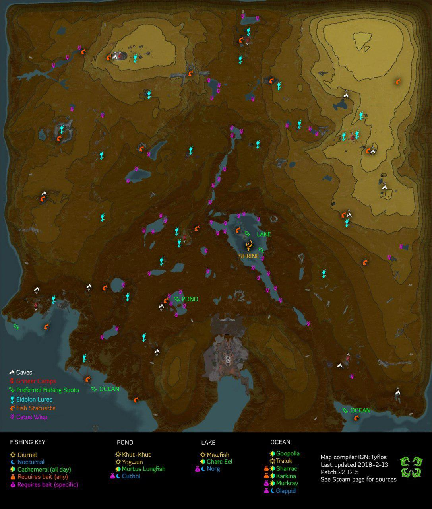
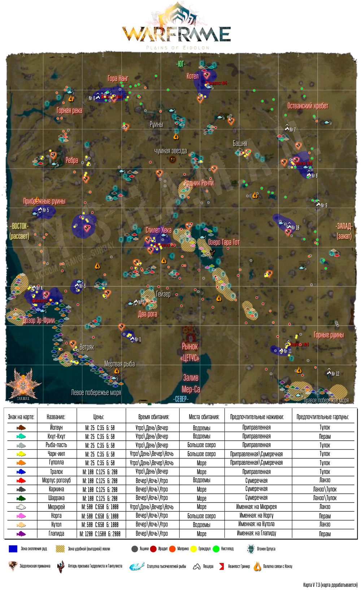
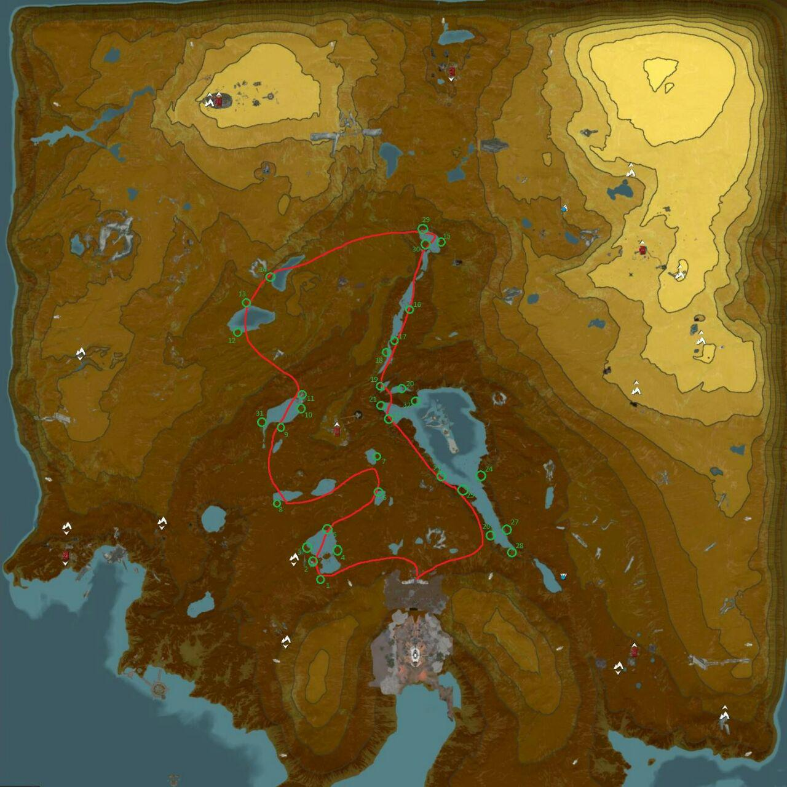
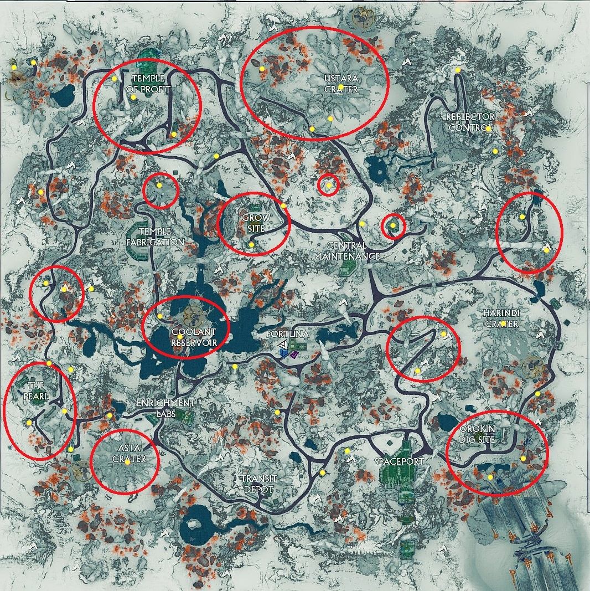
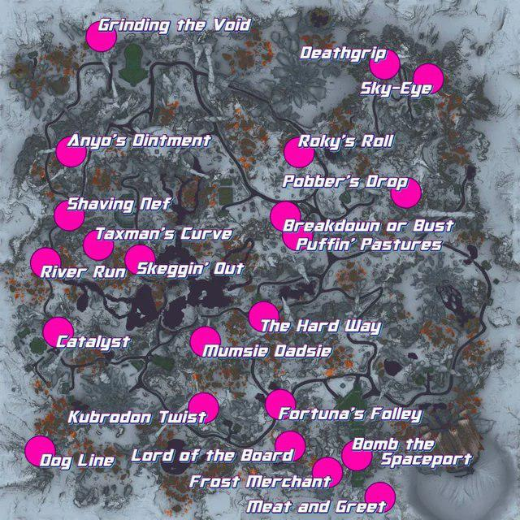
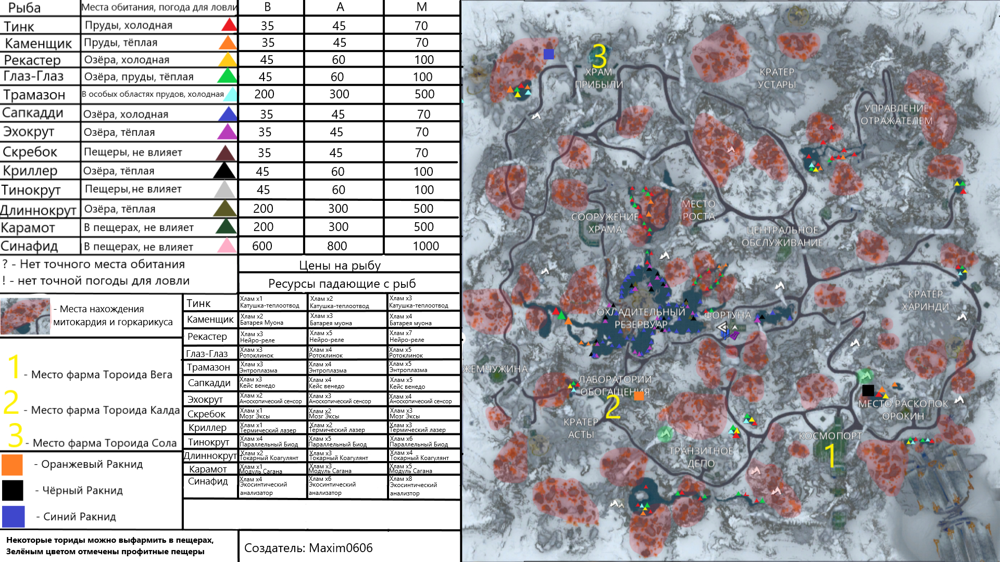
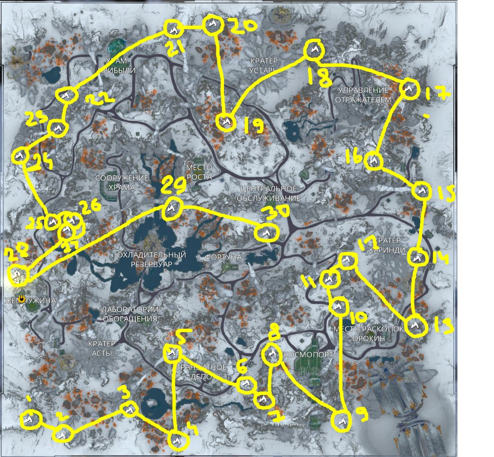
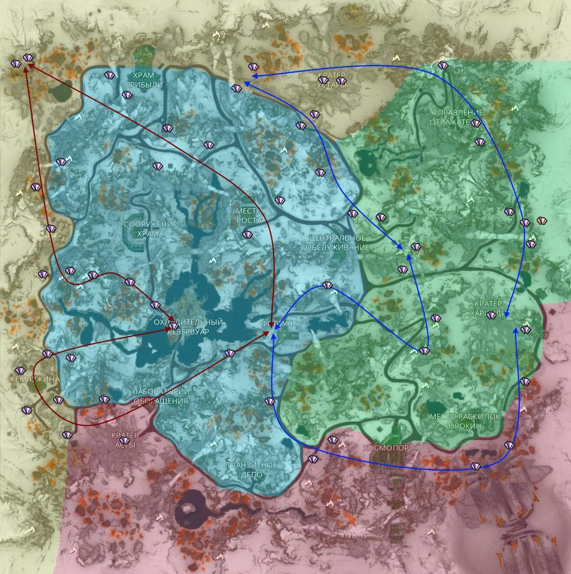
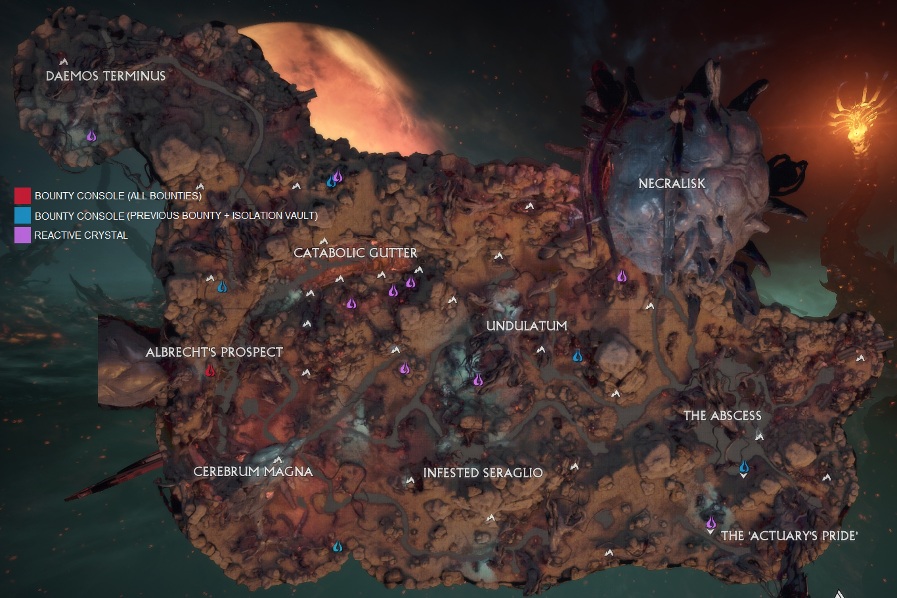

**[Возврат в оглавление](index.md)**

**Назад** 10. [Подробно о торговле](10.md)

### 11. Карты

  
 Карта Долины Эйдолонов 1 - Ловушки, светлячки, 1000летняя рыба

  

    

  
 Карта Долины Эйдолонов 2 - карта от Шамана v6.1

  

    

  
 Карта Долины Эйдолонов 3 - карта от Шамана v6.1(ловушки)

  

    

  
 Карта Долины Эйдолонов 4 - карта от Шамана v6.1(светлячки)

  

    

  
 Карта Долины Эйдолонов 5 - карта от Шамана v7.3

  

    

  
 Карта Долины Эйдолонов - светлячки

  

    

  
 Карта Фортуны 1 - пещеры+рыбалка

  

    

  
 Карта Фортуны 2 - сканирование на сомакорды

  

    

  
 Карта Фортуны 3 - карта Шамана v5.2.3

  

    

  
 Карта Фортуны 4

  

    

  
 Карта Фортуны 5 - гонки

  

    

  
 Карта Фортуны 6 - сканирование для Кодекса

  

    

  
 Карта Фортуны 7 - ресурсы

  

    

  
 Карта Фортуны 8 - карта Шамана v4.0

  

    

  
 Карта Фортуны 9 - 30 пещер - достижение

  

    

  
 Карта Фортуны 10 - сомакорды

  

    

  
 Карта Камбионский Дрейф 01 - Изоляция

  

    

  
 Карта Камбионский Дрейф 02 - тропа охоты

  

    

  
 Карта Камбионский Дрейф 03 - Мать, задания

  

    

  
 Карта Камбионский Дрейф 04

  

    

  
 Карта Камбионский Дрейф 05

  

    

**Далее** 11.б [Разная инфа в картинках](11_b.md)

**[Возврат в оглавление](index.md)**

