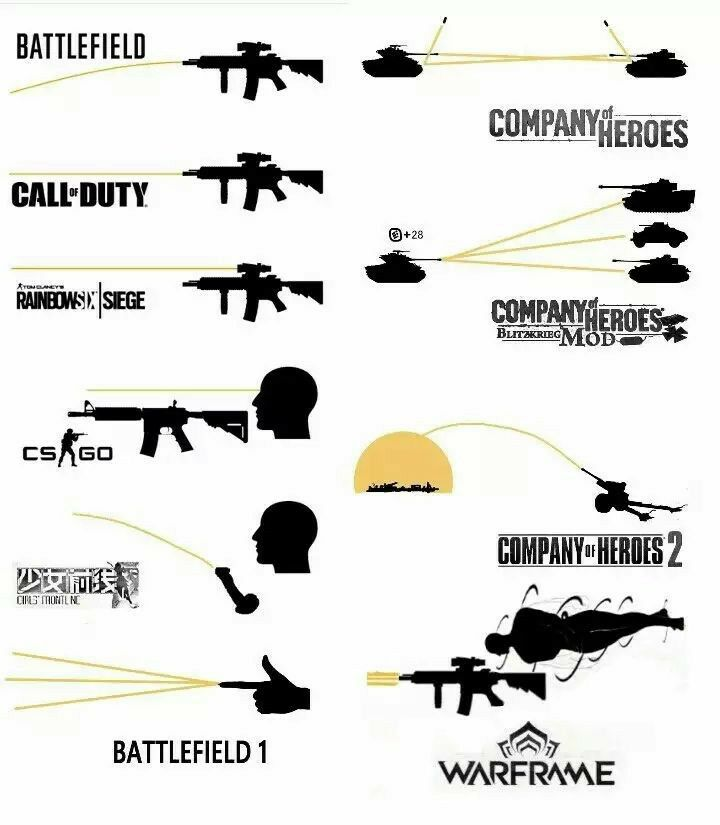
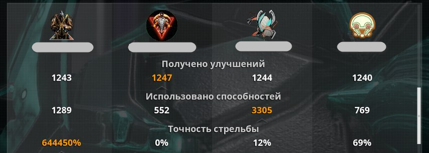
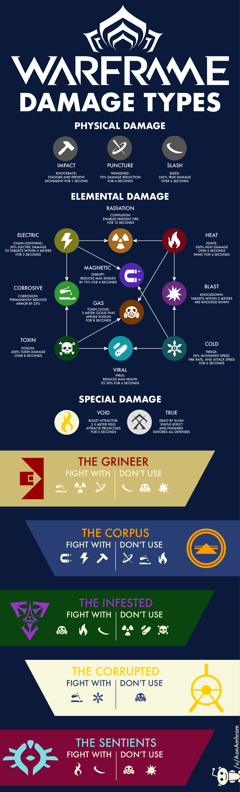
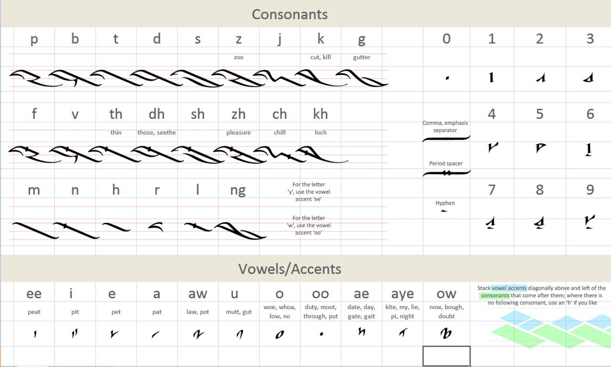
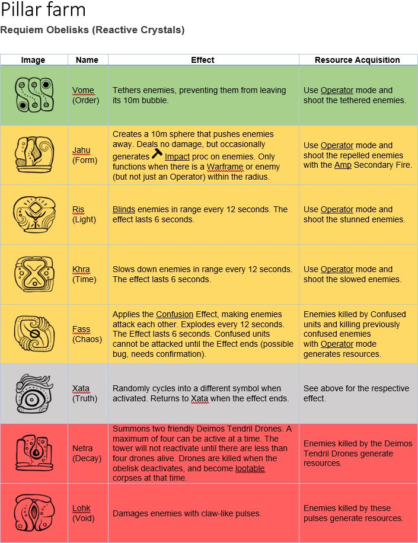
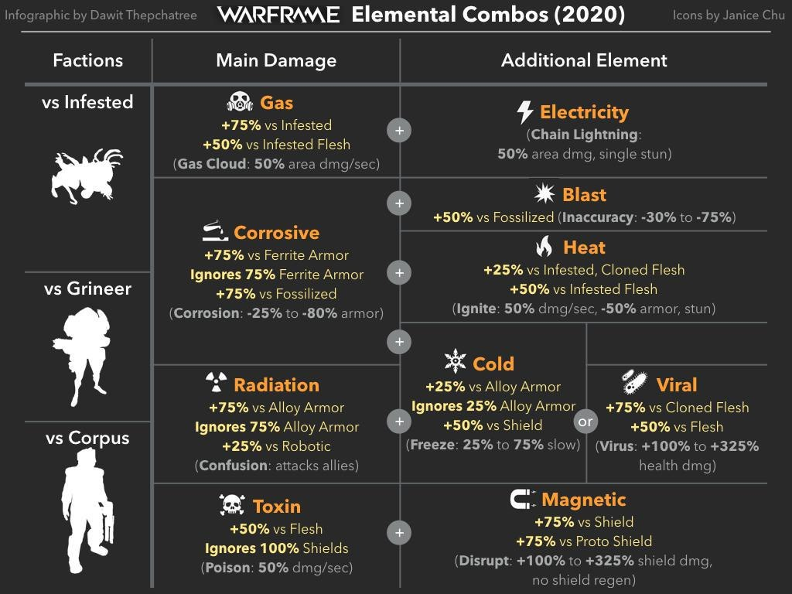
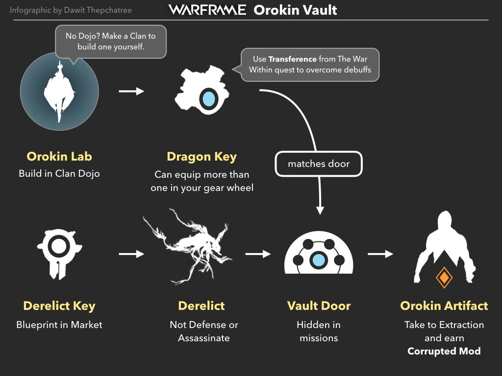
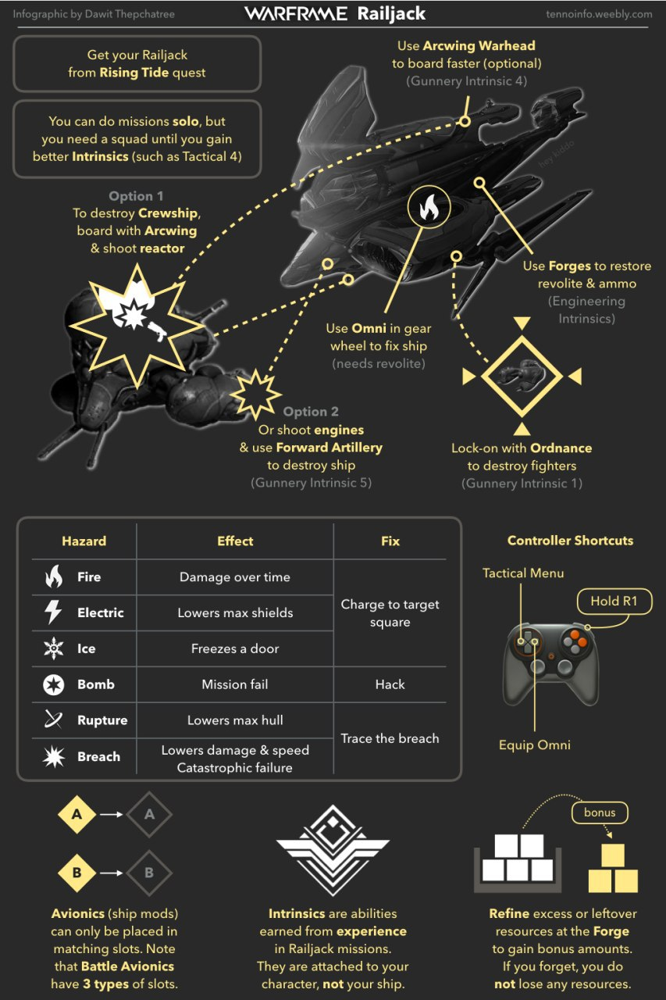
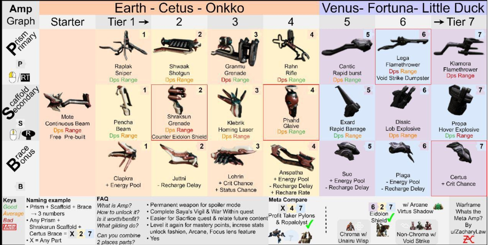

***
**[Возврат в оглавление](index.md)**

**Назад** 11. [Карты](11.md)
***

### 11.б Разная инфа в картинках

  
 1. Стрельба в играх 

  

    

  
 2. Баги - уровень точности - БОХ!!! 

  

    

  
 3. Типы урона в 2020 

  

    

  
 4. Типы Форм (Шутка!)  

  
")
    

  
 5. Алфавит Орокин 

  

    

  
 6. Стеллы в Камбионской дрейфе 

  

    

  
 7. Статусный урон по фракциям 

  

    

  
 8. Прохождение хранилищ в Руинах Орокин (Миссии Деймоса) 

  

    [Хранилище Орокин](https://warframe.fandom.com/ru/wiki/%D0%A5%D1%80%D0%B0%D0%BD%D0%B8%D0%BB%D0%B8%D1%89%D0%B5_%D0%9E%D1%80%D0%BE%D0%BA%D0%B8%D0%BD)

  
 9. РД - как уничтожать Транспорты 

  

    

  
 10. AMP - усилители для операторов 

  

    

***
**Далее** 12. [Подлинная история](12.md)

**[Возврат в оглавление](index.md)**